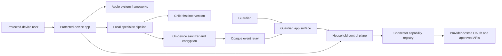
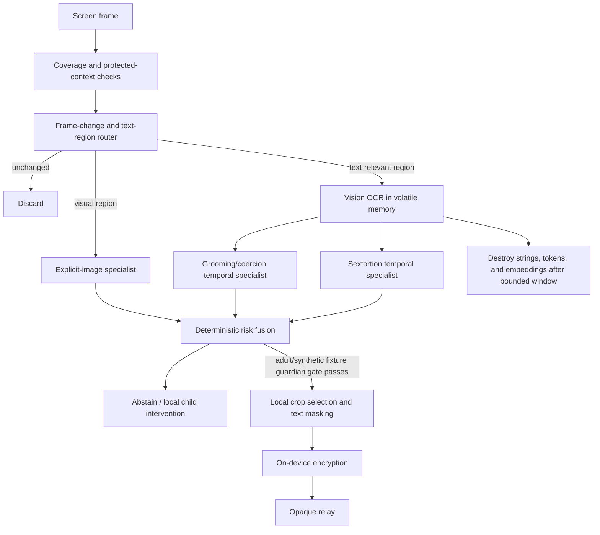
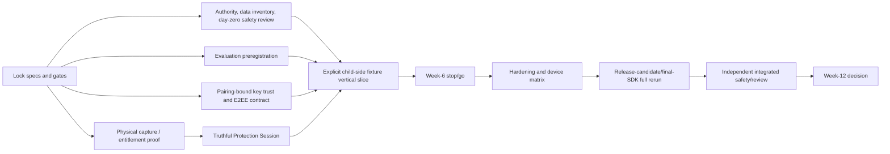

# Covenant Eyes Family-First Digital Safety

## Spec-Driven Engineering Plan for Claude Code, Cursor, and Codex

**Plan status:** Pre-implementation specification and gated execution plan; only safe platform/governance spikes begin before section 19 passes  
**Planning date:** August 6, 2026  
**Target:** A bounded Apple-first functional prototype and evidence package, not a commercial launch  
**Primary sources:**

- *Covenant Eyes Apple-First Family Digital Safety Prototype Report* (15 pages)
- *Covenant Eyes Family-First Digital Safety Feature Overview* (1 page)

This plan converts the two source documents into a single product specification, architecture, backlog, verification system, and operating model for three coding agents. It deliberately preserves the reports' central boundary: the first delivery is a 12-week validation program whose output is working software plus evidence for a stop, narrow, or proceed decision.

---

## 1. Engineering directive

Build a privacy-first Apple family-safety prototype that can:

1. Establish an adult-owned Covenant Eyes household and pair a protected device.
2. Provide useful prevention through Apple-native family controls even when screen analysis is unavailable.
3. Let the protected-device user visibly start and stop a full-display Protection Session.
4. Analyze changed screen regions locally with category-specific, purpose-trained models.
5. Intervene first on the protected device using fixed, reviewed guidance.
6. Exercise a neutral encrypted guardian concern signal only in an adult/synthetic fixture tenant; never send a transcript or generated accusation.
7. Show honest, separate coverage states for capture, prevention, inference, connection freshness, and guardian delivery.
8. Offer one Social Connection Hub while treating every provider as a separately authorized and separately limited integration.
9. Produce reproducible accuracy, latency, energy, privacy, safety, entitlement, and usability evidence at weeks 6 and 12.

The prototype must not claim or attempt covert, continuous, unstoppable, or universal monitoring. It must not collect social-media passwords or cookies, use Apple Sensitive Content Analysis as a guardian-reporting signal, generate guardian prose with an LLM, or treat a provider login as proof that private messages are available.

### 1.1 The product hypothesis

> A device-user-initiated, visibly active, on-device protection experience can recognize serious sexual-risk patterns early enough to help, while disclosing substantially less family content than transcript-oriented monitoring products.

The prototype succeeds only if protection, privacy, truthful coverage, and family comprehension all pass. Model accuracy alone is insufficient.

### 1.2 Prototype exit outcomes

At week 12, leadership chooses exactly one:

- **Proceed Apple-first:** prevention, Protection Sessions, and at least one independently validated `prototypeGuardianEnabled` adult/synthetic-fixture category justify a controlled engineering alpha; this does not authorize minor/family guardian delivery.
- **Proceed with bounded protection:** prevention and voluntary sessions are viable; one or more categories remain child-intervention-only.
- **Proceed narrowly:** explicit-image protection advances; grooming and sextortion remain research-only.
- **Stop or redesign:** capture usability, distribution, safety, evidence comprehension, device reach, or performance does not justify further investment.

No result from this program authorizes a family beta using live-minor communications.

### 1.3 Authorization recommended after adversarial review

Authorize the 12 weeks as a **feasibility and harm-reduction program**, not as validation of dependable grooming/sextortion monitoring. Start with a visible voluntary Protection Session, prevention controls, and an explicit-image child-side vertical slice. At kickoff:

- Grooming/coercion and sextortion are `researchOnly`.
- Guardian delivery is fixture-only and disabled for any real family account.
- Sanitized source pixels are off.
- Provider OAuth is connection/capability research; identity-only login earns no safety-coverage credit.
- URL Filter is a separately costed registration/PIR-service spike, not a guaranteed week-3 feature.
- Child-safety, domestic-abuse, CSAM, privacy, crypto, and App Review reviewers join the architecture log in week 0 and can stop or narrow work before week 11.

The week-6 decision may authorize additional adult/synthetic prototype paths. Even a `prototypeGuardianEnabled` result at week 12 means **prototype-capable on approved fixtures only**; it is not a production-minor release state.

---

## 2. Scope and source traceability

Page references in this plan use physical PDF page numbers as shown by a PDF viewer; the prototype report's printed footer is one page lower after the cover/contents.

### 2.1 In-scope prototype surfaces

| Surface | In scope | Source |
|---|---|---|
| Protected-device iPhone experience | Pairing, consent, family controls, URL filtering, Protection Session, local analysis, child intervention, truthful status | Prototype report pp. 5-10, 13 |
| Guardian experience | Household overview, neutral status, authenticated event review, fixed response flows on iPhone/iPad and an Apple-silicon Mac target if time permits | Prototype report pp. 6, 8-9; feature overview |
| On-device detection | Explicit-image specialist, OCR-as-router, grooming/coercion temporal specialist, sextortion temporal specialist, deterministic risk fusion | Prototype report pp. 7-8 |
| Social Connection Hub | Provider cards, provider-hosted OAuth, scopes, freshness, health, revoke, capability registry, two sanctioned test connections | Prototype report pp. 5-7, 13-14 |
| Control plane | Household/device metadata, consent state, device-held connector-token policy, encrypted event relay, push wakeups, feature/model policy, audit events | Implied by prototype report pp. 5-9; current App Review constraint in section 6 |
| Evidence and evaluation | Device matrix, model metrics, privacy assertions, safety reviews, entitlement/App Review findings, week-6 and week-12 scorecards | Prototype report pp. 10-12 |

### 2.2 Explicit non-goals

The following are not backlog items and must be rejected in review:

- Commercial launch, public beta, or marketing claims.
- Silent or automatically restarted full-display capture.
- Guaranteeing monitoring across every app, device, network stack, or social provider.
- Capturing a microphone, camera, screen recording file, or rolling clip buffer.
- Uploading raw clean, uncertain, or below-threshold frames.
- Sending OCR strings, embeddings, conversation text, or Apple Sensitive Content Analysis results off-device.
- Displaying raw conversations, generated summaries, diagnostic labels, or person-level allegations to guardians.
- Calling a person a groomer, predator, criminal, or confirmed extortionist.
- Credential collection, session-cookie replay, recovery-code collection, or undocumented provider scraping.
- Treating Apple Foundation Models or Sensitive Content Analysis as the decision authority.
- Making Apple Intelligence hardware a prerequisite for the baseline experience.
- Assuming VNC-only persistent capture entitlement access.

### 2.3 Source-to-spec map

| Source assertion | Canonical spec section |
|---|---|
| Permissioned capture is visible and interruptible | `REQ-CAP-01` through `REQ-CAP-08` and section 4.1 |
| Prevention remains useful without screen analysis | `REQ-PREV-01` through `REQ-PREV-05` and degraded-mode tests |
| Local specialist cascade with volatile OCR | `REQ-DET-01` through `REQ-DET-09`, architecture, and privacy invariants |
| Child-side action precedes guardian escalation | `REQ-INT-01` through `REQ-INT-04` and event workflow |
| No guardian transcript or generated text | `INV-PRIV-04`, `REQ-EVD-01` through `REQ-EVD-06`, closed schemas |
| Social access is provider-by-provider | `REQ-CONN-01` through `REQ-CONN-08` and capability registry |
| Device and provider coverage must be honest | `REQ-COV-01` through `REQ-COV-04` and section 4.2 |
| Category gates are independent | Model evaluation and release scorecard |
| Week-6 stop/go and week-12 decision | Delivery plan and decision gates |

Normative requirement-source map:

| ID set | Source / derivation |
|---|---|
| `REQ-ID-01..02`, `REQ-AGE-01` | Prototype report pp. 5, 13 |
| `REQ-PAIR-01..03`, `REQ-CONSENT-01`, `REQ-AUTH-01..04`, `REQ-LIFE-01..02` | Prototype report pp. 3, 5-6, 9, 11-13; pairing-key and hostile-authority tests derived from security/abuse review |
| `REQ-PREV-01..05` | Prototype report pp. 6, 11, 13; feature overview p. 1 |
| `REQ-COV-01..04` | Prototype report pp. 4-6, 10, 12-13; feature overview p. 1 |
| `REQ-CAP-01..08` | Prototype report pp. 4, 6-7, 10, 12-13; exact runtime/endurance contract derived from official Apple boundary and adversarial review |
| `REQ-DET-01..09` | Prototype report pp. 7-8, 10-12; signed/preparation and statistical acceptance details derived |
| `REQ-INT-01..04` | Prototype report pp. 6, 8, 11; unsafe-guardian cases derived from safeguarding review |
| `REQ-EVD-01..06`, `REQ-GDN-01..08` | Prototype report pp. 6, 8-10, 12; feature overview p. 1; mandatory E2EE/fixture restriction derived from crypto/CSAM review |
| `REQ-CONN-01..08` | Prototype report pp. 5-7, 9, 11-14; device-only social-token override from current App Review 5.1.1(v) |
| `NFR-PERF-01..05`, `NFR-ENERGY-01`, `NFR-THERM-01`, `NFR-PRIV-01` | Prototype report p. 10 |
| `NFR-ENDUR-01`, `NFR-RELY-01`, `NFR-SEC-01..02`, `NFR-ACC-01`, `NFR-LOC-01`, `NFR-OBS-01`, `NFR-REP-01` | Prototype report pp. 6, 9-12 plus derived reproducibility, accessibility, crypto, and adversarial gates |

`specs/requirements.yaml` must enumerate each concrete ID with `sourcePages`, `derivedFrom`, `acceptance`, `invariants`, and `tasks`. `make verify-specs` rejects an ID without source/derivation, a task without requirement/invariant links, or a requirement with no test/gate owner.

---

## 3. Canonical product specification

### 3.1 Actors and authority

| Actor | Can | Cannot |
|---|---|---|
| Accountable adult / guardian | Create a CE household, pair a device, complete Apple authorization, choose prevention settings, authorize their own provider accounts, receive permitted signals, revoke CE connections | Grant screen-capture permission on behalf of the device user; silently authorize another person's social account; view raw OCR or transcripts |
| Protected-device user | Review disclosures, complete device-side steps, start/stop a Protection Session, receive first-line intervention, request help, see coverage state | Be represented as continuously monitored when capture is stopped or unavailable |
| CE prototype operator | Configure signed feature/model policy, inspect content-free health metrics, run adult/synthetic evaluation, revoke compromised devices | Browse family content, decrypt D3/D4 events, add recipients, override device consent |
| Provider account holder | Complete provider-hosted authorization and disconnect it | Grant scopes a provider does not expose or that CE has not been approved to use |
| Safety/research reviewer | Inspect safeguarded research artifacts under a separate protocol and approve fixed copy and gates | Use production minor communications during this program |

### 3.2 Core user journeys

#### Journey A - Household setup

1. Adult signs in to Covenant Eyes with Sign in with Apple.
2. Adult reviews a concise data-use and role disclosure.
3. Adult creates a minimal protected-person profile using a nickname and optional declared age range; exact birthdate is not required.
4. The app creates a short-lived, single-use pairing code or QR code.
5. The protected device consumes the code and shows which household it will join.
6. Apple Family Controls authorization occurs as a separate system step.
7. The protected-device user separately starts a Protection Session through Apple's system capture picker.
8. Both parties see a coverage breakdown. A single generic "protected" badge is prohibited.

#### Journey B - Prevention without capture

1. Guardian selects apps, categories, or sites through Apple's privacy-preserving picker.
2. The app applies reviewed Managed Settings and Device Activity schedules.
3. URL Filter is included only if the kickoff scope ADR accepts the separately staffed PIR/registration branch and all registration, entitlement, dataset, privacy, availability, remediation, and device gates pass.
4. If capture is declined, stopped, or unavailable, prevention can remain active while screen-analysis coverage reads **Unavailable** with a reason.

#### Journey C - Active local protection

1. Device user opens Protection Session and reads the visible disclosure.
2. The system picker returns a full-display capture selection.
3. CE starts a screen-only stream; audio and camera outputs remain unattached.
4. Changed-region routing suppresses redundant frames.
5. The explicit-image specialist runs on relevant regions.
6. OCR runs only for text-relevant changed regions, then feeds bounded temporal models.
7. Deterministic fusion returns canonical `noElevatedSignal`, `checkInSuggested`, `actionRecommended`, `urgentReview`, or `statusUnknown`, with a category, confidence band, and abstention reason where applicable.
8. The child-side UI appears first. During this plan a guardian event can be created only in an approved adult/synthetic fixture tenant when `prototypeGuardianEnabled` and all category/human-safety gates pass.

#### Journey D - Fixture guardian response

1. Guardian receives a neutral notification without sensitive preview.
2. Authentication is required before event details open.
3. The event displays fixed reason copy, canonical safety state, time band, coverage state, and an optional separately approved adult/synthetic-fixture crop. Family/minor tenants are rejected.
4. The guardian chooses a fixed action such as **Check in**, **Offer help**, **Review family plan**, or **Acknowledge**.
5. The system records the response action, not a free-form accusation.

#### Journey E - Connection lifecycle

1. An account holder chooses a provider card.
2. CE opens provider-hosted OAuth using Authorization Code with PKCE or the provider-required SDK.
3. The provider returns approved scopes; CE records the actual capability set and expiry.
4. Social-network tokens remain on the device in Keychain and are used directly from the app while it is in use unless Apple has given a written resolution for the exact alternative design.
5. The card displays exactly what is and is not available.
6. Expiry, revocation, scope loss, API failure, or policy change moves that connector to a visible degraded/stale/disconnected state.
7. Disconnect revokes upstream access where supported and deletes local token/material.

### 3.3 Functional requirements

Every requirement is testable. Priority is a base level plus, where present, a scope modifier. The requirements registry and `make verify-specs` must reject any priority string outside this table.

| Priority | Exact gate semantics |
|---|---|
| `P0` | Required for the minimum week-12 evidence package. Failure stops or narrows the affected core capability. |
| `P1` | Required only after its corresponding P0 vertical slice passes; it cannot delay an earlier stop decision. |
| `P2` | Stretch work; it earns no core decision credit and may not displace P0/P1 safety work. |
| `P0-safety` | A P0 harm-control gate for the affected path. It must pass before that path can execute, even in fixtures; failure disables or narrows the path. |
| `P0-research` | The required P0 deliverable is a reviewed research/lawful-basis conclusion and explicit limitations, not production authorization. An incomplete or adverse result blocks production claims. |
| `P0-scope-decision` | A signed accept-or-defer ADR is required at kickoff. Deferral passes this decision requirement only when the feature is excluded, its fallback is truthful, and it earns no implementation credit. If accepted, all stated acceptance tests become mandatory. |
| `P0-conditional` | Required only if the named external approval/capability exists by the registered auto-defer date. Otherwise it is explicitly deferred, disabled, and worth no core or safety-coverage credit. |
| `P0-fixture` | Mandatory for the adult/synthetic guardian-fixture workstream to claim success. The whole workstream may defer at a gate without failing the minimum core package, but then all guardian fixture delivery remains disabled and earns zero guardian credit. |
| `P1-safety` | A post-P0 safety requirement that must pass before the affected later research or pilot phase; failure keeps that phase disabled. |
| `P1-fixture-only` | Post-P0 optional work restricted to approved adult/synthetic fixtures. It never authorizes minor/family pixels, delivery, research, or pilot use. |

#### Identity, pairing, consent, and lifecycle

| ID | Pri | Requirement | Acceptance evidence |
|---|---:|---|---|
| REQ-ID-01 | P0 | Use Sign in with Apple for the adult CE account. | First sign-in, repeat sign-in, revoked credential, relay-email, and account-deletion tests pass. |
| REQ-ID-02 | P0 | Represent the CE household separately from Apple Family Sharing and provider identities. | Domain model and UI never infer a Family Sharing roster or provider access from CE login. |
| REQ-PAIR-01 | P0 | Pair a protected device with a single-use code that expires in at most 10 minutes. | Reuse, expiry, wrong-household, race, and offline-error tests pass. |
| REQ-PAIR-02 | P0 | Bind a paired device to an app-generated hardware-backed key when available. | Server challenge verifies the device key; reinstall/recovery behavior is documented and tested. |
| REQ-PAIR-03 | P0 | Bind the initial guardian recipient-key fingerprint into the direct pairing transcript/QR and require protected-device confirmation. | Key-substitution, replay, wrong-recipient, and compromised-control-plane tests fail closed. |
| REQ-CONSENT-01 | P0 | Record separate versions and timestamps for CE terms, local-analysis disclosure, guardian-evidence consent, Family Controls status, and screen-capture status. | Consent ledger shows independent states; withdrawing one does not falsely alter the others. |
| REQ-AUTH-01 | P0-safety | Show a persistent protected-device roster of every guardian/accountability recipient and its last change. | A subject can always identify who may receive future events; hidden recipients are impossible. |
| REQ-AUTH-02 | P0-safety | Require adult step-up reauthentication and protected-device confirmation for guardian addition/change; show a delayed, persistent subject-visible notice. | Unauthorized, silent-add, short unlocked-device, replay, removal, and re-add tests pass. |
| REQ-AUTH-03 | P0-safety | Provide a disputed-authority/support state that freezes new guardian delivery without destroying required audit. | Custody/dispute tabletop names owner, SLA, evidence restrictions, restoration approval, and unsafe-guardian path. |
| REQ-AUTH-04 | P0 | Enforce an immutable program-environment gate: guardian delivery is available only to approved adult/synthetic fixture tenants during this 12-week plan. | Server and client both reject guardian delivery for family/production/minor tenant classes; remote flags cannot override. |
| REQ-AGE-01 | P1 | Use declared age range only to tailor copy and required consent paths; do not infer exact age. | Decline, unavailable, minor-range, adult-range, and region-dependent paths pass. |
| REQ-LIFE-01 | P0 | Support unpair, household removal, consent withdrawal, and account deletion. | Tokens, device eligibility, pending events, and retained fields follow the field-level deletion spec. |
| REQ-LIFE-02 | P1 | Define and prototype an adulthood-transition flow that requests fresh adult choice. | Synthetic time-transition test removes guardian access unless renewed by the now-adult user. |

#### Prevention and truthful coverage

| ID | Pri | Requirement | Acceptance evidence |
|---|---:|---|---|
| REQ-PREV-01 | P0 | Support Family Controls authorization and privacy-preserving selection of apps/sites/categories. | Authorized, denied, revoked, and changed-selection flows work on physical devices. |
| REQ-PREV-02 | P0 | Apply Managed Settings shields and Device Activity schedules independently of capture. | A schedule starts/stops locally and displays its actual status. |
| REQ-PREV-03 | P0-scope-decision | At kickoff, explicitly accept or defer a separately staffed URL Filter spike behind capability, CloudKit registration, dataset, and PIR-service gates. | ADR chooses fail-open or fail-closed by error class; WebKit/URLSession, PIR outage, signed dataset rollback, remediation, and unsupported-stack labeling tests pass if accepted. |
| REQ-PREV-04 | P0 | Support a time-bounded, guardian-confirmed pause of prevention rules separately from capture state. | Actor, start, expiry, reason code, and visible protected-device state are audited; pause auto-expires and cannot imply active prevention. |
| REQ-PREV-05 | P0 | Verify and truthfully display Apple-provided removal resistance only for the authorized child Family Controls path. | Physical-device child/individual/revoked authorization tests prove actual uninstall/sign-out behavior; unsupported modes make no claim. |
| REQ-COV-01 | P0 | Expose separate states for capture, prevention, inference readiness, connector freshness, and guardian delivery. | No screen contains an aggregate "good" state without its components and observation times. |
| REQ-COV-02 | P0 | Every state has `status`, `observedAt`, `reasonCode`, and `nextAction`. | Stale-state and clock-skew tests pass; UI renders unknown rather than guessing. |
| REQ-COV-03 | P0 | Capture interruption, stop, force-quit, lock, reboot, permission loss, and model failure update status promptly. | State accuracy is 100% in the preregistered device-interruption suite. |
| REQ-COV-04 | P0 | Send content-free status-change alerts for stopped, interrupted, permission-lost, stale, and restored states when network delivery is available. | Neutral payload reaches the guardian fixture tenant within the locked SLO, contains no category/content, and never converts a gap to `noElevatedSignal`. |

#### Visible Protection Session

| ID | Pri | Requirement | Acceptance evidence |
|---|---:|---|---|
| REQ-CAP-01 | P0 | Start full-display capture only from an explicit device-user action and Apple's system picker. | No code path starts a stream before picker completion. |
| REQ-CAP-02 | P0 | Show the canonical session states `unconfigured`, `ready`, `awaitingPicker`, `preparing`, `active`, `paused`, `declined`, `interrupted`, `stoppedByUser`, and `unavailable`. | Typed contract, reducer, and UI use the same enum; usability participants identify state and recovery action at the locked threshold. |
| REQ-CAP-03 | P0 | Attach screen frames only; do not attach microphone/camera outputs or recording/clip-buffer outputs. | Static check plus runtime privacy harness confirms prohibited APIs/outputs are absent. |
| REQ-CAP-04 | P0 | Never silently restart after a user stop or system interruption. | State-machine tests require a new explicit user action for every new session. |
| REQ-CAP-05 | P0 | Process frames with backpressure: at most three app-owned raw-frame buffers, at most 48 MB of app-owned raw/intermediate pixels, and release/explicit overwrite of app-owned buffers within 2 seconds after consumption. OCR temporal state is capped by the signed category policy at 10 minutes and 4 MB. | Stress and seeded-canary tests verify the limits; no claim is made that CE can zero Apple-managed framework copies. |
| REQ-CAP-06 | P0 | Model per-frame observability separately from the stream session. | A protected/blank frame sets `contentObservability=protectedOrBlank` while a live stream can remain `sessionState=active`; it never maps to clean or forces a picker restart. |
| REQ-CAP-07 | P0-research | Define protected-context suppression and a jurisdictional lawful-basis matrix for the device subject and non-user correspondents before production capture. | Banking, authentication, health, legal, configured help, shared-device, and bystander scenarios are tested; incompleteness is explicit and blocks production claims. |
| REQ-CAP-08 | P0 | Record an ADR naming the exact ScreenCaptureKit background mode, process-runtime eligibility path, compute-unit entitlement, cancellation behavior, system termination behavior, and CPU/foreground fallback. | Static review and 8-hour run prove no indefinite session is represented as a completing `BGContinuedProcessingTask`; unassigned paths fail visibly. |

#### Detection and intervention

| ID | Pri | Requirement | Acceptance evidence |
|---|---:|---|---|
| REQ-DET-01 | P0 | Use a category-specific explicit-image specialist behind a common inference protocol. | Core ML baseline passes golden tests on both device tiers. |
| REQ-DET-02 | P0 | Route unchanged frames without model/OCR work subject to preregistered minimum skip and maximum false-skip rates. | `evaluation-protocol.md` locks both rates before tuning; instrumented tests must pass both, and performance results are invalid if recall falls. |
| REQ-DET-03 | P0 | Run Vision OCR only on text-relevant changed regions and keep text-derived artifacts in volatile memory. | Data-flow test and memory/log audit find no OCR persistence or egress. |
| REQ-DET-04 | P0 | Treat grooming/coercion and sextortion as distinct temporal specialists with independent gates. | Each model has separate dataset card, scorecard, threshold, feature flag, and release state. |
| REQ-DET-05 | P0 | Require multiple independent signals for severe temporal events; one phrase or one score cannot trigger them. | Single-signal negative suite produces no severe event. |
| REQ-DET-06 | P0 | Treat sender, direction, chronology, app/account identity, and conversation continuity as unknown unless a preregistered attribution gate passes. | Temporal guardian mode requires the locked lower 95% confidence bound for attribution/direction/continuity; otherwise mandatory abstention keeps the category `researchOnly` or `childHelpOnly`. |
| REQ-DET-07 | P0 | Use deterministic, versioned risk fusion and support abstention. | Same normalized inputs and policy version always produce the same result. |
| REQ-DET-08 | P1 | Run Core AI only as a feature-flagged comparator until final-SDK/device gates pass. | Disabling Core AI returns to the Core ML baseline without user-visible loss of core function. |
| REQ-DET-09 | P0 | Prepare, verify, and cache required model assets during explicit onboarding, outside an active Protection Session. | Cold/warm, download failure, hash/signature failure, low storage, offline-after-ready, and rollback tests expose truthful readiness. |
| REQ-INT-01 | P0 | Show a fixed, counsel-reviewed child intervention before any guardian escalation. | Snapshot tests contain only approved copy IDs; no runtime text generation exists. |
| REQ-INT-02 | P0 | Offer leave/close, ask for help, contact a trusted adult, and high-concern reviewed actions as appropriate. | Every category/canonical-safety-state combination maps to a reviewed action set. |
| REQ-INT-03 | P0 | Record only action codes and coarse outcome, not free-form child text. | Schema deny-list and payload tests pass. |
| REQ-INT-04 | P0-safety | Design and test the cases where the configured guardian is unsafe, the coercive sender can see the screen, or the device may be confiscated. | Advocate-reviewed flow provides a discreet exit and approved non-guardian help option without claiming secrecy, rescue, or emergency response; unacceptable retaliation risk disables the affected intervention/escalation. |

#### Guardian evidence and response

| ID | Pri | Requirement | Acceptance evidence |
|---|---:|---|---|
| REQ-EVD-01 | P0-fixture | Fixture-only guardian event plaintext contains fixed reason code/copy, canonical safety state, event time, coverage snapshot, and integrity metadata. | Recursively closed allow-list schema passes with `additionalProperties: false`; unknown/aliased content fields are rejected. |
| REQ-EVD-02 | P0 | Machine-generated text, OCR text, source transcript, model rationale, and person-level labels are prohibited. | Schema, log, network, notification, and snapshot deny-list tests pass. |
| REQ-EVD-03 | P0 | Default temporal-category evidence is icon-only. | Grooming/sextortion fixtures create no image or readable-text evidence. |
| REQ-EVD-04 | P1-fixture-only | A sanitized visual crop may be exercised only with adult/synthetic fixtures after research, safeguarding, privacy, counsel, and CSAM-specialist sign-off on the exact data flow. | Client and server prohibit source pixels for minor/family tenants; fixture crop is minimal, text-masked, metadata-stripped, encrypted on-device, and its incident/CSAM tabletop has passed. |
| REQ-EVD-05 | P0-fixture | Push notifications contain no category detail or sensitive preview. | Adult/synthetic fixture lock-screen snapshot contains only neutral fixed copy. |
| REQ-EVD-06 | P0-fixture | Encrypt every guardian event field end-to-end and authenticate it to the protected-device key; CE services/operators cannot decrypt or add recipients. | Key substitution/transparency, recipient-membership, replay, revoke/rotation, recovery, server-compromise, and associated-data tamper tests pass. |
| REQ-GDN-01 | P0-fixture | Require local authentication before opening fixture event detail. | Locked/unlocked, biometric-failure, and device-passcode paths pass. |
| REQ-GDN-02 | P0-fixture | Display pattern/concern language, uncertainty, coverage, and a fixed next step in fixture accounts; never "proof." | Comprehension protocol passes and copy lint finds no prohibited terms. |
| REQ-GDN-03 | P0-fixture | Retention and deletion apply by field and evidence class. | Time-travel tests expire events and encrypted blobs per policy. |
| REQ-GDN-04 | P2 | Apple Watch provides only neutral haptic/check-in action. | No evidence, category, message content, or risk detail appears on wrist/lock screen. |
| REQ-GDN-05 | P1-safety | Provide an age/role-appropriate correction, dismissal, and support path for a mistaken event without creating a retaliation channel. | Policy names who can challenge/delete/correct, what audit remains, response SLA, and how the unsafe-guardian case is handled; tabletop passes before family research. |
| REQ-GDN-06 | P0-fixture | Show a 24/48-hour multi-child history that preserves observed gaps and coverage separately from safety state. | Time-window, child-switch, stale, no-signal-with-gap, and deletion tests pass; uncovered intervals never render clear/white. |
| REQ-GDN-07 | P0-fixture | Support canonical safety states `noElevatedSignal`, `checkInSuggested`, `actionRecommended`, `urgentReview`, and `statusUnknown`. | White/yellow/red/urgent-X concepts have fixed accessible labels; `urgentReview` remains a concern signal, never proof or emergency-service promise. |
| REQ-GDN-08 | P0-fixture | Provide a multi-child overview driven by the canonical safety and coverage contracts. | Mixed safety/coverage fixture states render independently and access remains household/role scoped. |

#### Social Connection Hub

| ID | Pri | Requirement | Acceptance evidence |
|---|---:|---|---|
| REQ-CONN-01 | P0 | Use provider-hosted OAuth with Authorization Code + PKCE or an approved SDK. | Network trace and UI review show no CE-hosted credential field. |
| REQ-CONN-02 | P0 | Request minimum scopes only when the associated feature is enabled. | Scope diff tests fail if an unneeded scope is requested. |
| REQ-CONN-03 | P0 | Keep social-network credentials/tokens on-device in Keychain and use them for direct provider access from the app while it is in use. | Network/storage tests find no social token off-device; disconnect revokes where supported and deletes local state. Any exception requires written Apple/App Review and legal resolution for the exact design before implementation. |
| REQ-CONN-04 | P0 | The capability registry records provider, account alias, scopes, data types, region, review status, freshness, token health, revocation, and last success. | Provider card is rendered from registry data and has truthful unsupported states. |
| REQ-CONN-05 | P0-conditional | Prototype two truthful OAuth connections and, only if approved, one safety-relevant retrieval capability using adult-owned test accounts; no provider artifact may enter risk fusion or create a safety event in this plan. | Connect, refresh, retrieve a capability fixture, prove local bounded handling/deletion, revoke, and delete tests pass. Identity/profile-only OAuth earns zero safety credit. |
| REQ-CONN-06 | P0 | A connected state never implies private-message access. | Copy lint and capability tests prohibit capability inference from login success. |
| REQ-CONN-07 | P0 | Use direct-to-device, in-use retrieval for App Store social flows; server-side social processing is outside this plan absent written Apple/legal resolution. | Every adapter declares artifact class, execution location, maximum lifetime, cursor/idempotency, retention/deletion, and permitted use; build fails if a provider artifact can reach risk fusion. |
| REQ-CONN-08 | P0 | Require the actual provider account holder to complete authorization; CE guardian/household login is insufficient. | Wrong-person, guardian-only, canceled-consent, account-switch, reauth, and revoke tests prove subject authorization. |

### 3.4 Nonfunctional requirements

| ID | Requirement | Prototype gate |
|---|---|---|
| NFR-PERF-01 | Changed-frame decision, high-tier device | p95 < 100 ms |
| NFR-PERF-02 | Changed-frame decision on iPhone SE (2nd generation), or a documented slower final-iOS-27-compatible tier if Apple's final matrix changes | p95 < 250 ms; exact hardware identifier, battery health, and OS build recorded |
| NFR-PERF-03 | Explicit-content child intervention after decisive frame | p95 < 500 ms |
| NFR-PERF-04 | Temporal response after threshold is met | p95 < 2 s |
| NFR-PERF-05 | Adult/synthetic fixture guardian delivery with working capture and network | p95 < 5 s |
| NFR-ENERGY-01 | Added active-day battery consumption | < 5% under the locked usage profile |
| NFR-THERM-01 | Sustained execution | No thermal throttling in a 30-minute locked stress test |
| NFR-ENDUR-01 | User-started endurance | An 8-hour locked ordinary-use session publishes gaps, terminations, compute path, battery delta, and state freshness on high/low tiers |
| NFR-PRIV-01 | Prohibited raw data egress | Exactly zero observations in instrumented runs |
| NFR-RELY-01 | Capture-status truth | 100% correct transitions in the interruption suite |
| NFR-SEC-01 | Secrets in logs/build artifacts | Zero; verified by secret scan and log audit |
| NFR-SEC-02 | Guardian-event confidentiality and recipient integrity | Mandatory E2EE for D3/D4; no CE service/operator decryption or invisible recipient addition |
| NFR-ACC-01 | Accessibility | VoiceOver, Dynamic Type, Reduce Motion, contrast, and non-color severity cues pass |
| NFR-LOC-01 | Localization safety | Fixed copy is key-based and supports expansion; no severity is conveyed by untranslated model text |
| NFR-OBS-01 | Content-free observability | Health, version, latency, and state-transition metrics work without content payloads |
| NFR-REP-01 | Reproducibility | Every scorecard records code SHA, spec revision, model hash, dataset version, device/OS, and policy version |

Performance targets come from the prototype report. Accuracy and comprehension thresholds must be preregistered at kickoff using the process in section 8; the team may not tune them after seeing the locked evaluation set.

The performance protocol must also lock device battery health, ambient temperature, brightness, radio/network state, app mix, frame rate, changed-frame prevalence, warm/cold model state, sampling duration, start/end timestamps, and confidence intervals. Every energy/latency result is paired with recall so an overaggressive frame router cannot appear efficient by missing content.

### 3.5 Hard privacy and safety invariants

These are build-breaking rules, not aspirational principles.

| ID | Invariant |
|---|---|
| INV-PRIV-01 | Raw frames exist only in bounded volatile memory and are never written to files, telemetry, crash attachments, clipboard, or analytics SDKs. |
| INV-PRIV-02 | Clean, uncertain, below-threshold, and unapproved-category frames are discarded locally. |
| INV-PRIV-03 | OCR strings, text tokens, embeddings, and Apple Sensitive Content Analysis outputs never leave the protected device. |
| INV-PRIV-04 | Guardian-visible text is selected from a versioned, counsel-approved fixed-copy catalog. |
| INV-PRIV-05 | D3/D4 guardian events are mandatorily end-to-end encrypted; no CE service/operator can decrypt them, substitute a recipient key, or add a recipient invisibly. |
| INV-PRIV-06 | No provider password, session cookie, recovery code, or MFA code enters a CE-controlled form or log. |
| INV-PRIV-07 | Source pixels are prohibited for every minor/family tenant, study, or pilot in this plan; sanitized visual crops exist only in approved adult/synthetic fixtures. |
| INV-SAFE-01 | Child intervention precedes guardian escalation. |
| INV-SAFE-02 | A single phrase, keyword, OCR result, or model score cannot create a severe grooming/sextortion event. |
| INV-SAFE-03 | The system reports a pattern and uncertainty, never a diagnosis or accusation about a person. |
| INV-SAFE-04 | Each category can be independently `researchOnly`, `localShadow`, `childHelpOnly`, `prototypeGuardianEnabled`, or `disabled`; no prototype state authorizes production-minor use. |
| INV-SAFE-05 | No external family beta starts with an unresolved critical child-safety, domestic-abuse, CSAM, privacy, security, or App Review issue. |
| INV-CONSENT-01 | Device-user screen-capture consent is distinct from guardian, household, Family Controls, and provider authorization. |
| INV-CONSENT-02 | A stopped or unavailable stream cannot be represented as active protection. |
| INV-RESEARCH-01 | Guardian delivery is rejected for every tenant except the non-overridable adult/synthetic fixture environment during this plan. |

---

## 4. State and contract specifications

### 4.1 Protection Session state machine

```mermaid
stateDiagram-v2
    [*] --> unconfigured
    unconfigured --> ready: onboarding complete
    ready --> awaitingPicker: device user taps Start
    awaitingPicker --> preparing: picker returns full display
    awaitingPicker --> declined: user cancels or declines
    declined --> ready: a fresh attempt may be offered
    preparing --> active: stream and baseline model ready
    preparing --> unavailable: setup or entitlement error
    active --> paused: device user pauses Protection Session; app stops stream
    paused --> ready: resume requires fresh picker
    active --> interrupted: terminal stream invalidation
    active --> stoppedByUser: user stops
    interrupted --> ready: interruption ends; explicit restart required
    stoppedByUser --> ready: explicit restart available
    unavailable --> ready: cause resolved
```



Rules:

- Only `active` may claim a live ScreenCaptureKit session; usable analysis additionally requires `analysisState=ready` and `contentObservability=observable`.
- Inference/model degradation is an orthogonal `analysisState`; it does not falsify the stream lifecycle.
- A protected/blank frame is orthogonal `contentObservability=protectedOrBlank`; it neither means clean nor requires a picker restart while the stream remains live.
- `paused`, `declined`, `interrupted`, and `stoppedByUser` all require a fresh explicit start/picker flow before returning to `active`.
- `interrupted` never auto-transitions to `active`; a fresh user action is required.
- A known stop changes local state synchronously and adult/synthetic fixture guardian coverage within 5 seconds; no cached success state may override it.

### 4.2 Coverage model

Safety status and coverage are independent. The canonical dashboard safety values are `noElevatedSignal`, `checkInSuggested`, `actionRecommended`, `urgentReview`, and `statusUnknown`. `noElevatedSignal` means only that no released-category threshold was met during the stated observed window; it never means "safe" and never fills an uncovered gap with white/clear status. `urgentReview` is still a concern signal, not proof or an emergency-service promise.

Do not store one `coverageGood` Boolean. `specs/contracts/coverage-snapshot.schema.json` is the single canonical, recursively closed contract; API, reducer, history, fixture relay plaintext, and UI types are generated from it. Every dimension uses the same required four-field wrapper, and each dimension owns its observation time rather than inheriting a misleading aggregate timestamp. A canonical instance is:

```json
{
  "schemaVersion": 1,
  "generatedAt": "2026-08-06T20:43:00Z",
  "safetyState": {
    "status": "statusUnknown",
    "observedAt": "2026-08-06T20:43:00Z",
    "reasonCode": "coverage_gap",
    "nextAction": "review_coverage"
  },
  "sessionState": {
    "status": "active",
    "observedAt": "2026-08-06T20:42:58Z",
    "reasonCode": "user_started",
    "nextAction": "stop_or_pause"
  },
  "contentObservability": {
    "status": "protectedOrBlank",
    "observedAt": "2026-08-06T20:42:59Z",
    "reasonCode": "protected_surface",
    "nextAction": "none"
  },
  "analysisState": {
    "status": "ready",
    "observedAt": "2026-08-06T20:42:57Z",
    "reasonCode": "coreml_baseline_ready",
    "nextAction": "none"
  },
  "preventionState": {
    "status": "active",
    "observedAt": "2026-08-06T20:40:00Z",
    "reasonCode": "schedule_applied",
    "nextAction": "manage_schedule"
  },
  "providerConnectionState": {
    "status": "degraded",
    "observedAt": "2026-08-06T20:35:00Z",
    "reasonCode": "one_connector_stale",
    "nextAction": "reconnect_provider"
  },
  "guardianDeliveryState": {
    "status": "fixtureReady",
    "observedAt": "2026-08-06T20:42:55Z",
    "reasonCode": "synthetic_tenant",
    "nextAction": "none"
  }
}
```

`safetyState` uses the five canonical dashboard values above. `sessionState` uses exactly the enum in REQ-CAP-02. `contentObservability` is `observable`, `protectedOrBlank`, `unsupported`, `stale`, or `unknown`. `analysisState` is `preparing`, `ready`, `degraded`, `unavailable`, or `unknown`. `preventionState` is `active`, `pausedByGuardian`, `unavailable`, `stale`, or `unknown`. `providerConnectionState` is `notConnected`, `authorizing`, `connectedIdentityOnly`, `connectedApprovedData`, `degraded`, `expired`, `scopeLost`, `revoked`, or `policyBlocked`. `guardianDeliveryState` is `fixtureReady`, `fixtureUnavailable`, `blockedTenant`, or `stale`. The schema requires `status`, RFC 3339 `observedAt`, allow-listed `reasonCode`, and fixed-copy/action `nextAction` on every wrapper, rejects unknown fields at every level, and contains no generic `coverageGood` value. Clock-skew and staleness policy may convert a wrapper to a stale/unknown value but may not silently refresh `observedAt`.

### 4.3 Guardian event and relay contracts

Split relay-visible routing from encrypted guardian plaintext. The relay sees only a recursively closed `RelayEnvelope`:

```json
{
  "schemaVersion": 1,
  "opaqueEventId": "uuid",
  "opaqueRecipientKeyId": "paired-key-id",
  "protectedDeviceKeyId": "opaque-device-key-id",
  "ciphertext": "base64-aead-ciphertext",
  "nonce": "base64",
  "expiresAt": "RFC3339 timestamp",
  "deviceSignature": "signature-over-associated-data-and-ciphertext"
}
```

Category, safety state, reason, device alias, coverage, model version, and evidence are all inside `GuardianEventPlaintext`, encrypted on the protected device:

```json
{
  "schemaVersion": 1,
  "eventId": "uuid",
  "householdId": "opaque-id",
  "protectedDeviceAlias": "opaque-alias",
  "category": "explicitVisual | groomingCoercion | sextortion",
  "safetyState": "checkInSuggested | actionRecommended | urgentReview",
  "confidenceBand": "moderate | high",
  "reasonCode": "fixed-catalog-key",
  "occurredAt": "RFC3339 timestamp",
  "coverageSnapshot": {
    "schemaVersion": 1,
    "generatedAt": "RFC3339 timestamp",
    "safetyState": {"status": "statusUnknown", "observedAt": "RFC3339 timestamp", "reasonCode": "fixed-code", "nextAction": "fixed-action"},
    "sessionState": {"status": "active", "observedAt": "RFC3339 timestamp", "reasonCode": "fixed-code", "nextAction": "fixed-action"},
    "contentObservability": {"status": "observable", "observedAt": "RFC3339 timestamp", "reasonCode": "fixed-code", "nextAction": "fixed-action"},
    "analysisState": {"status": "ready", "observedAt": "RFC3339 timestamp", "reasonCode": "fixed-code", "nextAction": "fixed-action"},
    "preventionState": {"status": "active", "observedAt": "RFC3339 timestamp", "reasonCode": "fixed-code", "nextAction": "fixed-action"},
    "providerConnectionState": {"status": "notConnected", "observedAt": "RFC3339 timestamp", "reasonCode": "fixed-code", "nextAction": "fixed-action"},
    "guardianDeliveryState": {"status": "fixtureReady", "observedAt": "RFC3339 timestamp", "reasonCode": "fixed-code", "nextAction": "fixed-action"}
  },
  "evidenceKind": "none | sanitizedVisualCrop",
  "sanitizedVisualCrop": "optional fixture-only bytes",
  "modelPolicyVersion": "version",
  "retentionExpiresAt": "RFC3339 timestamp"
}
```

Both JSON Schemas use recursively closed allow-lists with `additionalProperties: false`; name-based deny-lists are defense in depth only. They must reject fields named or aliased as `text`, `transcript`, `ocr`, `tokens`, `embedding`, `summary`, `caption`, `rationale`, `senderIdentity`, `accusedPerson`, `rawFrame`, or `scaResult`.

The guardian public-key fingerprint is bound into the direct device-pairing transcript. AEAD associated data binds schema version, opaque event ID, recipient key ID, protected-device key ID, and expiry; the protected-device key signs associated data plus ciphertext. The relay cannot replace a recipient, add one, or decrypt. Guardian addition/change requires REQ-AUTH-02 and new events use the rotated approved recipient set; past ciphertext is never silently rewrapped. Recovery and multi-guardian choices require the P0 crypto ADR before the fixture relay, with destructive evidence loss preferred to a hidden CE decrypt path.

### 4.4 Category policy contract

```yaml
category: sextortion
releaseState: researchOnly
allowedTenantClass: adultSyntheticFixture
modelHash: sha256:...
fusionPolicyVersion: 1
requiredSignals: 2
severeSingleSignalAllowed: false
guardianEvidence: none
childInterventionCopyId: child.sextortion.offer_help.v1
guardianReasonCopyId: guardian.sextortion.pattern.v1
thresholdSetId: preregistered-2026-08
approvedBy:
  product: pending
  privacy: pending
  safeguarding: pending
  modelRisk: pending
```

The application fails closed to the safer release state when a policy is missing, expired, unsigned, or incompatible. `allowedTenantClass` is constrained by the compiled program manifest; remote policy cannot widen fixture delivery or enable source pixels for a family/minor tenant.

---

## 5. Technical architecture

### 5.1 System context



The capture-to-intervention critical path is entirely local. Network loss may delay guardian delivery or connector refresh but must not prevent local inference or child intervention once assets are prepared.

### 5.2 Recommended repository shape

```text
/
  AGENTS.md
  CLAUDE.md
  Makefile
  README.md
  specs/
    product.md
    requirements.yaml
    invariants.md
    coverage-state.md
    event-envelope.schema.json
    category-policy.schema.json
    platform-capabilities.md
    data-inventory.yaml
    retention-policy.yaml
    copy-catalog.yaml
    threat-model.md
    evaluation-protocol.md
    decision-scorecard.yaml
    adr/
  apps/apple/
    FamilySafety.xcodeproj
    App/
    Extensions/
      DeviceActivityMonitor/
      ShieldConfiguration/
      ShieldAction/
      URLFilterControl/
    Packages/
      Domain/
      IdentityPairing/
      Prevention/
      ProtectionSession/
      InferenceRuntime/
      RiskFusion/
      Intervention/
      Evidence/
      GuardianExperience/
      Connections/
      Security/
      Policy/
      Observability/
      DesignSystem/
  services/
    contracts/
    control-plane/
    event-relay/
    connector-worker/          # only approved non-social/server flows
    push-gateway/
    url-filter-pir/            # separately gated and staffed
  models/
    manifests/
    conversion/
    evaluation/
    cards/
  tests/
    contract/
    privacy/
    security/
    fixtures/
    device-matrix/
    usability/
  scripts/
  artifacts/
    scorecards/
    device-runs/
    reviews/
```

Use Swift 6, SwiftUI, structured concurrency, and Swift Package boundaries for Apple code. The control-plane language should follow Covenant Eyes' existing production standard. If no standard is supplied by the end of week 1, use a minimal typed service behind the OpenAPI/JSON Schema contracts and record that choice in an ADR; do not let backend-framework selection block the device feasibility work.

### 5.3 Apple app modules

| Module | Responsibility | Must not own |
|---|---|---|
| `Domain` | IDs, enums, state machines, clocks, policy types | UI, networking, framework adapters |
| `IdentityPairing` | SIWA, household session, pairing protocol, device key enrollment | Family Controls or provider auth |
| `Prevention` | Family Controls, picker tokens, Managed Settings, Device Activity, URL Filter status | Screen capture |
| `ProtectionSession` | System picker, stream lifecycle, frame delivery, interruption state | Model-specific logic or recordings |
| `InferenceRuntime` | Frame routing, Vision OCR adapter, Core ML baseline, Core AI comparator | Guardian copy or network transport |
| `RiskFusion` | Temporal windows, deterministic feature fusion, abstention, category policy | Raw persistence |
| `Intervention` | Fixed child-side UI and action codes | Generated text |
| `Evidence` | Crop selection, text masking, metadata stripping, encryption, deny-list validation | Relay decryption |
| `GuardianExperience` | Household status, authenticated event viewer, fixed actions | Raw OCR/transcripts |
| `Connections` | OAuth sessions, capability registry client, token lifecycle, adapters | Password UI or undocumented scraping |
| `Security` | Keychain, Secure Enclave-backed agreement where appropriate, signatures, key rotation | Product decisions |
| `Policy` | Signed flags, copy catalog, model/category release state | Arbitrary remote code or prompts |
| `Observability` | Content-free metrics and privacy assertions | Content values, screenshots, OCR |

All Apple framework calls sit behind small protocols so simulators and deterministic fakes can test state logic without pretending simulator results prove physical-device behavior.

### 5.4 Local inference pipeline



Implementation constraints:

- Enforce the REQ-CAP-05 frame/temporal memory budgets and document measured high-water marks.
- Store derived categorical features only if the data inventory explicitly permits them.
- Avoid static keyword matching as the primary temporal classifier.
- Make the Core ML and Core AI adapters conform to the same typed interface and output calibration contract.
- Keep model asset preparation outside active sessions and expose readiness truthfully.
- If Neural Engine background access is unavailable, choose the measured CPU/foreground fallback or mark inference degraded; do not hide the transition.

### 5.5 Control plane

The minimum services are logical boundaries and may share a deployable process during the prototype:

| Service | Stores/processes | Explicitly prohibited |
|---|---|---|
| Household control plane | Adult account ID, household/device aliases, roles, consent versions, public keys, policy assignments | Screen frames, OCR, transcripts |
| Pairing service | Hashed single-use code, expiry, device public key, attempt/rate-limit state | Long-lived pairing secret in plaintext |
| Event relay | Encrypted envelope/blob, routing metadata, expiry, delivery receipt | Standing private key that decrypts evidence |
| Push gateway | Opaque event-ready token and neutral notification copy ID | Category or evidence in notification payload |
| Connector coordinator | Provider metadata, granted scopes, freshness, health, review status | Inferred capabilities not returned by provider |
| Provider token handling | Device-held Keychain references and content-free connection status only | Off-device social-network credentials/tokens without written Apple resolution; passwords, cookies, recovery/MFA codes |
| Policy service | Signed feature flags, model manifests, copy catalogs, category release states | Generated guardian copy or executable scripts |
| Audit service | Actor, action code, target alias, timestamp, policy/spec version | Content payloads |
| URL Filter PIR spike | Signed/versioned Bloom/dataset manifests, PIR protocol, availability, rollback/kill switch, remediation state | Query logging, query reconstruction from server logs/backups, consumer URL history, cross-use with guardian/event analytics |

Before the fixture relay is built, accept a crypto/enrollment ADR that implements section 4.3: the protected device authenticates the recipient-key fingerprint through pairing, encrypts all event fields with AEAD, signs the envelope, and verifies a subject-visible recipient roster. The relay holds only opaque ciphertext/routing data and cannot decrypt or add recipients. Multi-guardian recovery may remain a later UX decision only after this baseline trust path exists; destructive evidence loss is preferable to a hidden CE decrypt path.

Apple's current App Review Guideline 5.1.1(v) prohibits storing social-network credentials or tokens off-device and limits their use to direct connection from the app while it is in use. Therefore, the source report's proposed encrypted server refresh-token vault is **not** the default architecture. Any webhook, provider secret, or server connector must first prove that it is not storing/using a prohibited social token, or obtain written Apple/App Review and legal resolution for the exact provider and flow. Encryption at rest alone does not resolve the policy conflict.

### 5.6 Connector adapter contract

Every connector implements:

```text
authorizationMetadata()
beginAuthorization(PKCEChallenge)
completeAuthorization(callback)
refreshAuthorization()
capabilities(grantedScopes, region, reviewStatus)
retrieveCapabilityFixture(cursor) -> PermittedProviderArtifact
revoke()
deleteLocalAndServerState()
health()
```

Every capability returned by `capabilities` includes `supportLevel` (`approved`, `testOnly`, `unsupported`, `unknown`), `dataTypes`, `executionLocation`, `freshnessSLO`, `retentionClass`, `requiredScopes`, and `sourceOfTruth`. UI is rendered from this object rather than hard-coded marketing copy.

`PermittedProviderArtifact` is a P0 capability-proof type, not a safety signal. It declares provider/account/region, official data type, consent subject, provider cursor/idempotency key, fetched/expiry times, execution location, retention class, ML-use permission, and deletion receipt. During this plan it remains in a bounded on-device test sandbox, is deleted after the approved check, and has no dependency path to `RiskFusion`, `SafetyEvent`, evidence, or guardian delivery. A future provider-content classifier needs its own category/data/evidence gate and `NormalizedSafetySignal` contract.

For App Store-distributed social connectors, authorization and permitted retrieval run on-device while the app is in use by default. The control plane may store content-free capability/health metadata, but not the social token. Server-side connector workers remain disabled for social accounts unless the exact design clears the written policy gate above.

Provider assumptions for the prototype:

- Instagram/Facebook login does not imply access to a child's personal-account DMs.
- TikTok portability is not a US real-time message stream.
- Snapchat Login Kit does not provide private messages, shared content, or contacts.
- YouTube authorization is limited to granted API scopes, not global Google activity.
- Discord OAuth or a bot is limited to approved scopes and locations where it is installed/permissioned.

Choose the two OAuth demonstrations based on obtainable approval and the optional local capability-retrieval proof based on documented, sanctioned access. A polished unsupported provider card is acceptable; fabricated content access is not. The retrieval proof does not feed classification or guardian events in this plan.

Provider references for capability fixtures:

- [Snap Login Kit](https://developers.snap.com/snap-kit/login-kit/overview)
- [TikTok Data Portability API](https://developers.tiktok.com/products/data-portability-api/)
- [Discord OAuth2 and permissions](https://docs.discord.com/developers/platform/oauth2-and-permissions)
- [OAuth 2.0 for YouTube Data API](https://developers.google.com/youtube/v3/guides/auth/installed-apps)
- [Official Meta Instagram API workspace](https://www.postman.com/meta/instagram/documentation/6yqw8pt/instagram-api)

---

## 6. Current Apple capability boundary

The source report's platform claims were rechecked against current Apple documentation on August 6, 2026. Treat beta APIs as provisional until the final SDK and OS reproduce the results.

| Capability | Build against | Do not assume | Required proof |
|---|---|---|---|
| ScreenCaptureKit on iOS 27 | Person-selected full-display stream through the system picker; Apple's sample declares a `screen-capture` background mode | Silent, permanent, universal, auto-restarted, or uninterruptible capture | Physical-device continuity/state suite and App Review pre-submission evidence |
| App Review 2.5.14 | Explicit consent plus clear visual/audible indication for recording/logging user activity | Family Controls consent substitutes for screen-capture consent | Consent/UI review and reviewer notes |
| App Review 5.1.1(v) | In-app social credential revocation and direct, in-use, on-device connection | Off-device storage of social-network credentials/tokens, even in an encrypted vault | Device-only token data-flow tests or written Apple resolution for the exact exception |
| App Review 4.10 | Monetization must be based on CE's substantive service/value | Charging primarily for built-in Screen Time APIs or other OS capabilities | Business-model/App Review dossier and counsel review |
| Family Controls | Guardian/device authorization, privacy-preserving picker tokens, removal resistance where Apple provides it | Message access, Family Sharing roster discovery, control of capture stop | Entitlement assigned to app and every extension; physical-device tests |
| Managed Settings / Device Activity | Local shields, schedules, thresholds, responses | Exportable global app/site history | Revocation and schedule tests |
| URL Filter | Privacy-preserving full-URL filtering for WebKit/URLSession; voluntary participation elsewhere | Consumer browsing-history feed or automatic coverage of every networking stack | Registration/entitlement status, WebKit/URLSession/unsupported-stack matrix |
| Filter reporting | Supervised-device branch only | US consumer blocked-URL reporting | Keep disabled in consumer prototype unless supervision is explicit |
| FamilyActivityData | EU-only, entitlement-gated research branch | US/global named activity baseline | Separate feature flag, region, authorization, and entitlement evidence |
| Core ML | Baseline on-device inference and broad fallback | Guaranteed Neural Engine-only execution | Device-tier accuracy/performance scorecards |
| Core AI | Feature-flagged custom-model comparator on supported Apple silicon | Production readiness before final SDK and device validation | Model parity, first-load, caching, accuracy, energy, thermal, memory results |
| Background inference | Entitlement is required for Neural Engine access while backgrounded | Screen frame delivery automatically grants background Neural Engine access | Entitlement status and measured fallback |
| BGContinuedProcessingTask | A foreground-started, visible, cancellable task that completes a defined job | A mechanism for an indefinite protection session or automatic ongoing monitoring | REQ-CAP-08 ADR and static/runtime proof that the session path does not misuse it |
| Foundation Models | Adult/synthetic R&D comparator only | Stable availability, safety-category coverage, detection authority, live-minor processing | Never on alert path |
| Sensitive Content Analysis | Local intervention in CE-controlled media when policy/entitlement allow | Guardian reporting, CE fused signal, grooming/sextortion detection | Result cannot enter event, telemetry, or fusion types |
| Persistent Content Capture | No CE dependency | VNC entitlement applies to family monitoring | Static dependency check |
| Declared Age Range | Privacy-preserving age range with system consent and region behavior | Exact birthdate, identity proof, or universal parental-consent ledger | Decline/unavailable/region/transition tests |

Primary references:

- [Capturing screen content on iOS](https://developer.apple.com/documentation/screencapturekit/capturing-screen-content-on-ios)
- [App Review Guidelines](https://developer.apple.com/app-store/review/guidelines/)
- [Family Controls](https://developer.apple.com/documentation/familycontrols)
- [Requesting the Family Controls entitlement](https://developer.apple.com/documentation/familycontrols/requesting-the-family-controls-entitlement)
- [URL filters](https://developer.apple.com/documentation/networkextension/url-filters)
- [Network Extension updates](https://developer.apple.com/documentation/updates/networkextension)
- [FamilyActivityData](https://developer.apple.com/documentation/familycontrols/familyactivitydata)
- [Core AI](https://developer.apple.com/documentation/coreai/)
- [Background Inference entitlement](https://developer.apple.com/documentation/bundleresources/entitlements/com.apple.developer.background-tasks.continued-processing.inference)
- [BGContinuedProcessingTask](https://developer.apple.com/documentation/backgroundtasks/bgcontinuedprocessingtask)
- [Sensitive Content Analysis](https://developer.apple.com/documentation/sensitivecontentanalysis/)
- [Persistent Content Capture](https://developer.apple.com/documentation/bundleresources/entitlements/com.apple.developer.persistent-content-capture)
- [Declared Age Range](https://developer.apple.com/documentation/declaredagerange/requesting-people-share-their-age-range-with-your-app)

---

## 7. Privacy, security, abuse, and safeguarding design

### 7.1 Data classification

| Class | Examples | Storage/transport rule |
|---|---|---|
| D0 - Public configuration | App version, public provider capability description | Normal integrity controls |
| D1 - Operational metadata | Content-free latency, state transition, build/model hash, device tier | Pseudonymous; bounded retention; no content-derived value except approved coarse result codes |
| D2 - Household confidential | Household/device aliases, consent version, connector scopes/health | Encrypted at rest/in transit; role-scoped; audited |
| D3 - Safety event plaintext | Category, safety state, reason code, time band, coverage snapshot | Mandatory E2EE from protected device to authenticated fixture guardian; no CE service/operator decryption or recipient insertion; strict retention |
| D4 - Sanitized fixture evidence | Separately approved adult/synthetic cropped, text-masked pixels | Fixture tenants only; mandatory E2EE; relay ciphertext-only; prohibited in every minor/family study or pilot in this plan |
| D5 - Ephemeral prohibited-from-egress | Raw frames, OCR strings/tokens/embeddings, SCA results, model intermediate content features | Volatile memory only; no logs, files, crash reports, analytics, clipboard, backups, or network |
| D6 - Never collect | Social passwords/cookies/recovery/MFA codes, microphone/camera, screen recordings/clips | No schema, input, API, or debug path may accept them |

`specs/data-inventory.yaml` must name every field, class, purpose, legal/safety owner, storage location, encryption, access roles, retention, deletion trigger, and telemetry eligibility. CI fails when a persisted schema field lacks an inventory entry.

### 7.2 Abuse cases and controls

| Threat / misuse | Failure mode | Required control | Gate |
|---|---|---|---|
| Coercive or abusive guardian | Product becomes a surveillance or punishment tool | Visible device-user capture, no transcript, child-first help, neutral copy, easy access to trusted-help information, anti-coercion review, adulthood transition | Independent domestic-abuse review; no unresolved critical finding |
| False allegation | Ambiguous pixels or text cause guardian to accuse a child/third party | Multiple signals, abstention, fixed pattern language, no sender identity, no person labels, comprehension study | Category remains `childHelpOnly` or `researchOnly` if neutral interpretation threshold fails |
| Child bypass or ordinary interruption | Session is stopped while dashboard implies coverage | Separate live coverage dimensions, freshness timestamps, interruption tests, status-change alert | 100% state correctness in locked suite |
| Account takeover | Attacker receives child-safety signals | SIWA state/nonce, step-up auth, device key, session rotation, rate limits, local auth for evidence, revoke-all flow | Threat-model and penetration findings resolved |
| Pairing hijack | Wrong household binds a device | Short TTL, single use, displayed household identity, protected-device confirmation, rate limit, bind to device key | Race/replay/wrong-household tests |
| Relay/control-plane compromise | Event metadata/evidence exposed or recipient key substituted | Opaque relay envelope, pairing-bound recipient fingerprint, subject-visible roster, device signature, key-transparency/substitution tests, short TTL | Crypto ADR and compromise drill |
| Off-device social-token design | App rejection/policy violation and broader token exposure | Device-held Keychain tokens and direct in-use provider calls; no server token vault without written Apple resolution | App Review 5.1.1(v), connector security, and provider terms gate |
| Model extraction/adversarial content | Evasion or crafted overlay changes result | Signed assets, model integrity check, adversarial evaluation, confidence/abstain, policy rollback | Model security scorecard |
| Debugging leakage | Screens/OCR appear in logs/crash reports | Content types cannot conform to log serializers; release logging allow-list; crash attachment scrub; network deny-list tests | Zero prohibited observations |
| Insider misuse | Employee accesses family event metadata | Least privilege, JIT access, immutable audit, separation of duties, no operator evidence decrypt | Access-control review and audit drill |
| Provider policy drift | Connector silently loses or changes access | Registry `observedAt`, health checks, scope diff, kill switch, visible stale/unsupported state | Connector freshness and revocation tests |
| Notification disclosure | Lock screen reveals risk category | Neutral payload and copy, no image/category/severity | Snapshot and payload tests |

### 7.3 Evidence transformation contract

A sanitizer is a pure, testable adult/synthetic-fixture pipeline. It is unreachable for minor/family tenants in this plan:

1. Verify category and policy permit visual evidence.
2. Select the smallest meaningful non-text visual region.
3. Detect text regions locally.
4. Expand masks by a safety margin and replace pixels irreversibly.
5. Remove notifications, status-bar identifiers, faces/unrelated identities when specified by policy.
6. Strip EXIF and all source metadata.
7. Downscale to the approved resolution and re-encode into a new buffer.
8. Run OCR again on the output as a leak check; if text remains, discard the crop.
9. Encrypt to the guardian key.
10. Explicitly overwrite and release CE-owned source/intermediate buffers within the REQ-CAP-05 limit; do not claim control over Apple-managed copies.

Any failure yields `evidenceKind: none`; it must never fall back to a full screenshot. A future minor/family source-pixel path requires a new, separately approved architecture that resolves mandatory reporting, preservation, guardian display, staff exposure, incident operations, and jurisdictional law; no gate in this plan can enable it.

### 7.4 Logging and telemetry policy

Use an allow-list, not a redact-after-the-fact strategy. Permitted examples:

- Capture state transition and reason code.
- Frame-routing counts, not frame hashes or perceptual signatures.
- Inference latency, memory, compute unit, model hash, and coarse result enum.
- Sanitizer success/failure code, never crop dimensions that could become a fingerprint without review.
- Event delivery state and opaque event ID.
- Connector status, granted scopes, expiry class, and last-success time.

Disallowed examples include OCR length, recognized language if derived from private text without approval, tokens, embeddings, raw confidence vectors tied to a family, screenshots, free-form errors containing provider callbacks, and request/response bodies.

### 7.5 Required independent reviews

Complete before any decision to involve families:

- Child-safety and developmental review.
- Domestic-abuse/coercive-control review.
- CSAM handling and mandatory-reporting counsel review.
- Privacy and data-protection impact assessment, including children's data.
- Product security architecture and penetration review.
- Model-risk, subgroup, and false-alert review.
- Apple entitlement and App Review strategy review.
- Provider terms, developer-policy, scope, and permitted-use review for each connector.

These reviews may narrow or remove a feature. They are not documentation exercises that can be waived by an engineering lead.

Review cadence begins in week 0: reviewers approve the authority model, data inventory, evidence boundary, notification/copy constraints, and research materials before those components are built. Week 11 is the independent integrated re-review, not the first safety review.

Authoritative starting points for counsel/reviewer work include the [FTC COPPA compliance plan](https://www.ftc.gov/business-guidance/resources/childrens-online-privacy-protection-rule-six-step-compliance-plan-your-business), [18 U.S.C. § 2258A](https://uscode.house.gov/view.xhtml?edition=prelim&num=0&req=granuleid%3AUSC-prelim-title18-section2258A), the [UK ICO Children's Code guidance on parental controls](https://ico.org.uk/for-organisations/uk-gdpr-guidance-and-resources/childrens-information/childrens-code-guidance-and-resources/age-appropriate-design-a-code-of-practice-for-online-services/11-parental-controls/), and the [California DOJ CCPA overview](https://oag.ca.gov/privacy/ccpa). These links frame issues for qualified review; the engineering plan does not make a legal conclusion.

---

## 8. Model and evaluation specification

### 8.1 Evaluation boundary

Allowed during the 12-week program:

- Adult-owned devices.
- Synthetic conversations and visual fixtures.
- Licensed datasets with documented rights and safeguarding controls.
- Separately consented adult research materials under an approved protocol.
- Reviewer-safe material for TestFlight/App Review.

Prohibited:

- Live-minor production communications.
- Scraped private messages.
- Unreviewed CSAM or unlawful material.
- Training/evaluation data whose consent, provenance, age, or use right is unknown.
- Reusing the locked decision set during tuning.

This boundary can establish engineering feasibility and reveal failures; it cannot establish real-world child safety, production base-rate accuracy, family behavior, or lawful deployment. Week-12 category labels must say `adult/synthetic prototype evidence` and must not be converted into a public accuracy or protection claim.

### 8.2 Dataset cards

Each category has a separate dataset card with:

- Provenance, license/consent, safeguarding owner, and intended use.
- Unit of evaluation: image, frame region, message turn, or multi-turn sequence.
- Synthetic-generation method and human review.
- Positive/negative taxonomy and ambiguous cases.
- Provider/UI layouts, typography, dark/light mode, languages, accessibility sizes, and image/text overlays.
- Device capture artifacts, rotation, compression, blur, occlusion, and protected-content cases.
- Split strategy by conversation/scenario/template source to prevent leakage.
- Subgroup and language coverage; explicit unknowns.
- Known exclusions and invalid uses.
- Version, hash, and change log.

### 8.3 Category-specific approach

#### Explicit visual

- Compact image classifier/detector on changed regions.
- Evaluate both false positives on benign skin/health/art/content and false negatives on partial, stylized, small, blurred, or overlaid content.
- Separate local warning performance from guardian-event performance.
- Never use Apple SCA results as labels, fused features, or guardian telemetry.

#### Grooming/coercion

- Stateful, bounded multi-turn model over ephemeral OCR-derived representation.
- Candidate signals: trust-building, secrecy, age probing, channel migration, boundary testing, sexual escalation, isolation, and pressure.
- No single signal creates a severe event.
- Do not infer or display the identity or intent of a sender. Mandatory abstention applies when direction, chronology, speaker, or conversation continuity does not meet the preregistered confidence gate.

#### Sextortion

- Stateful model with independent evidence and threshold.
- Candidate signals: sexual context, threat to expose, money/image demand, urgency, repeated contact, and escalating coercion.
- Require at least two independent signal families for severe escalation.
- A successful explicit model does not advance this category.

### 8.4 Metrics

Report at minimum:

- Precision, recall, false-positive rate, false-negative rate, PR-AUC, and calibration error.
- False guardian-event rate by household episode, device hour, and projected child-year under the locked benign simulation, with upper 95% confidence bounds and stated prevalence assumptions.
- Time-to-intervention from decisive frame or temporal-threshold crossing.
- Abstention rate and outcome on abstained cases.
- Per-device-tier latency, energy, thermal, memory, model load, and first-use preparation.
- Per-language and preregistered subgroup slices where data is adequate.
- Worst-group delta and confidence interval.
- Interruption, directionality, speaker/chronology, and conversation-continuity accuracy/abstention with lower 95% confidence bounds.
- Guardian comprehension: neutral interpretation, correct next action, certainty overclaim, and accusation/punishment intent.
- Adult protected-user role-play comprehension: ability to identify session state, ask for help, and stop/restart behavior, explicitly labeled as not evidence about teens.

### 8.5 Preregistration protocol

By the end of week 1, a review group containing product, ML, privacy, safeguarding, and executive ownership signs `specs/evaluation-protocol.md` and `specs/decision-scorecard.yaml`.

The locked protocol names:

- Category thresholds and whether they apply to child intervention or guardian delivery.
- Minimum precision/recall and maximum episode/device-hour/child-year false-alert rate, including which lower or upper 95% confidence bound must pass.
- Required sample size, confidence interval method, and an automatic `guardian delivery disabled` outcome when the interval cannot support the claim.
- Subgroups/languages that must be reported and maximum allowed disparity.
- Capture reliability and state-comprehension thresholds.
- Guardian and adult protected-user role-play comprehension thresholds. Any future minor UX study is separate, minimal-risk research requiring ethics/legal approval, parental consent where required, child assent, no production communications, and its own retention plan.
- Battery/thermal/device matrix.
- Exact stop/narrow rules.
- Locked dataset hashes.

The following provisional engineering recommendations should be debated and either adopted or replaced before the benchmark is opened:

| Gate | Provisional recommendation |
|---|---|
| Explicit-image fixture guardian event | Lower 95% bound: precision >= 99.9% and recall >= 90%; upper 95% bound: <= 0.1 false event per simulated child-year, reported by household episode as well as time |
| Grooming/sextortion fixture guardian event | Lower 95% bound: precision >= 99.9%, recall target set by safeguarded research, and attribution/direction/continuity >= 99%; upper 95% bound: <= 0.05 false severe event per simulated child-year; zero single-signal severe events |
| Worst preregistered subgroup gap | <= 5 percentage points for primary metric unless review board documents why data is insufficient and category remains non-guardian |
| Guardian neutral comprehension | Lower 95% bound >= 99% choose a check-in/help interpretation; upper 95% bound < 1% interpret it as proof/person-level accusation; any material punishment, outing, retaliation, or suppressed help-seeking disables delivery |
| Protected-user coverage comprehension | >= 95% correctly identify active vs stopped/interrupted/unavailable and the next action |
| Capture usability | An 8-hour locked ordinary-use run on high/low tiers publishes every gap/termination; 100% of known stops change local state immediately and online guardian state within 5 seconds; zero false-active states; covered minutes reconcile within 1% |

These numbers are intentionally demanding because a false guardian allegation can cause serious harm. If sample sizes cannot support the promised confidence, the category remains `researchOnly` or `childHelpOnly`.

### 8.6 Leakage and reproducibility controls

- Split by scenario author/template, not by individual frame or turn.
- Hash and lock tuning and decision datasets separately.
- Prevent agents from opening decision labels while implementing models.
- Record all tuning runs, selected checkpoints, and threshold changes.
- Re-run the locked suite from a clean environment using immutable model/data manifests.
- Require two independent reproductions for a week-6 or week-12 category claim.
- Include adversarial negatives specifically written to resemble keywords without risk.
- Include positive patterns without obvious keywords.
- Run UI-layout perturbation and OCR-error robustness tests.
- Treat benchmark contamination or post-hoc threshold changes as a failed gate, not a minor process issue.

---

## 9. Spec-driven multi-agent operating model

### 9.1 One source of truth

All three agents work from the same versioned `specs/` directory. Chat history, a Cursor tab, or an agent's recollection is never authoritative. Precedence is:

1. Safety/privacy invariants.
2. Accepted ADRs and platform capability record.
3. Requirements and schemas.
4. Task packet.
5. Code comments and agent conversation.

If two higher-level sources conflict, the agent stops that task, writes a short conflict note, and requests a spec decision. It must not silently choose the less restrictive interpretation.

### 9.2 Recommended division of labor

This is a work-mode allocation, not a claim that any tool is incapable of another task.

| Tool | Primary role | Typical owned outputs | Review relationship |
|---|---|---|---|
| Claude Code | Spec steward and deep implementation owner for domain contracts, control-plane/security, connector abstractions, and model/evaluation plumbing | YAML/JSON schemas, ADRs, service contracts, threat-model updates, complex cross-file implementations | Cursor reviews developer usability/UI implications; Codex verifies contracts, tests, and integration |
| Cursor | Human-in-the-loop Apple UX implementation | SwiftUI flows, design system, state presentation, accessibility, pairing/consent/coverage screens, guardian viewer | Claude Code checks spec conformance; Codex runs device/test matrices and adversarial UI/state checks |
| Codex | Integration, isolated work packets, platform spikes, test harnesses, CI, reproducibility, and release evidence | Apple framework adapters, privacy/contract tests, build scripts, scorecard automation, integration PRs | Claude Code reviews architecture; Cursor inspects visible behavior |

Keep a named human product/safety owner for policy decisions. Coding agents may surface options and evidence but may not approve guardian copy, safety thresholds, legal basis, provider permitted use, or an external beta.

### 9.3 Branch and ownership protocol

- Protect `main`; every change is a small PR tied to one task ID and one spec revision.
- Use separate worktrees/branches: `claude/<task-id>`, `cursor/<task-id>`, `codex/<task-id>`.
- Assign file ownership per active task. Two agents do not edit the same source file concurrently.
- Shared schemas/specs are changed by a dedicated spec PR before dependent code PRs.
- Generated artifacts are reproducible and not hand-edited.
- A PR author cannot be the only reviewer of a privacy invariant, crypto boundary, category gate, or entitlement claim.
- Rebase/merge only after the contract suite and required platform lane pass.

### 9.4 Task packet template

No agent starts coding from a vague milestone. Every task uses:

```yaml
id: CE-CAP-003
title: Implement Protection Session state reducer
specRevision: <commit SHA>
owner: codex
reviewers: [claude-code, cursor]
dependsOn: [CE-CAP-001]
scope:
  - apps/apple/Packages/Domain
  - apps/apple/Packages/ProtectionSession
requirements: [REQ-CAP-01, REQ-CAP-02, REQ-CAP-04, REQ-COV-03]
invariants: [INV-CONSENT-01, INV-CONSENT-02]
inputs:
  - specs/coverage-state.md
  - specs/platform-capabilities.md
deliverables:
  - deterministic state reducer
  - fake ScreenCaptureKit adapter
  - transition tests
acceptance:
  - every transition in the spec has a test
  - interruption never auto-reactivates
  - protected/blank content never maps to clean
forbidden:
  - recording output
  - clip buffer
  - microphone or camera output
verification:
  - make test-apple-unit
  - make verify-privacy
evidence:
  - artifacts/scorecards/CE-CAP-003.json
```

### 9.5 Definition of ready

A task is ready only when:

- Requirement and invariant IDs are named.
- Dependencies and owned files are known.
- Platform capability is either verified or explicitly a spike.
- Test fixtures are legal and safe to use.
- Acceptance includes observable behavior and a command/manual protocol.
- Non-goals and prohibited data paths are explicit.
- A reviewer other than the implementer is assigned.

### 9.6 Definition of done

A task is done only when:

- Code and spec are consistent.
- Unit/contract/privacy tests pass.
- Physical-device evidence exists when the task touches Apple runtime behavior.
- No new persisted field lacks data-inventory and retention entries.
- No new log/metric lacks telemetry review.
- Accessibility and error/denial/revocation paths are tested for UI work.
- Generated scorecard names code, spec, model/data versions, device, and OS.
- Reviewer records `accept`, `narrow`, or `reject` with reasons.
- No critical or high issue is hidden in a TODO.

### 9.7 Agent handoff record

Every session ends with:

```text
Task ID and spec revision:
Outcome:
Files changed:
Requirements satisfied:
Tests and observed results:
Physical-device evidence:
Unresolved risks/questions:
Exact next command:
Suggested next owner:
```

This prevents one agent's conversational context from becoming an undocumented dependency.

### 9.8 Adversarial review loop

For each epic:

1. Implementer submits the smallest vertical slice and evidence.
2. A second agent performs a spec/contract review without editing the implementation.
3. A third agent receives the requirement, diff, tests, and scorecard and tries to falsify the claim.
4. The implementer addresses findings or narrows the claim.
5. The human owner approves policy/safety consequences.

Adversarial prompts must ask: How could this imply coverage that is absent? How could content escape? How could a coercive guardian misuse it? Which Apple/provider rule could invalidate it? Which test passes only because the fake is unrealistic? What would make us stop?

---

## 10. Planned verification interface

The repository should expose stable top-level commands even if their internal implementation changes:

```text
make bootstrap              # validate pinned developer dependencies
make verify-specs           # schema, ID, traceability, copy, data-inventory checks
make test-apple-unit        # simulator-safe pure logic and UI tests
make test-services          # control-plane/relay/connector tests
make test-contracts         # JSON Schema/OpenAPI and consumer/provider compatibility
make test-models            # unlocked development evaluation only
make test-privacy           # seeded canaries across data-flow, log, crash, file, backup, clipboard, relay, push, analytics, and intercepted network paths
make test-security          # SAST, dependency, secret, auth/rate-limit tests
make test-accessibility     # automated checks plus manual protocol manifest
make build-apple            # signed development build
make device-plan            # print exact physical-device/OS matrix and scripts
make scorecard              # aggregate immutable run artifacts
make verify-all             # every non-physical blocking lane
```

### 10.1 CI lanes

| Lane | Trigger | Blocks merge | Output |
|---|---|---:|---|
| Spec integrity | Every PR | Yes | Missing IDs, broken traceability, schema/copy/data inventory errors |
| Apple unit/UI | Apple code | Yes | Test bundle and accessibility snapshots |
| Contracts/services | Schema/service changes | Yes | Provider/consumer compatibility report |
| Privacy invariant | Any app/service/model change | Yes | Payload/log/file/network deny-list report |
| Security | Every PR + nightly deep scan | Yes for critical/high | SAST, dependency, secrets, auth abuse results |
| Model development | Model/pipeline changes | Yes for regression threshold | Development-set scorecard; never decision labels |
| Device matrix | Scheduled/manual on signed build | Blocks week gates | Signed run manifest with device, OS, thermal, energy, state results |
| Locked evaluation | Authorized gate candidate only | Blocks category promotion | Immutable independent scorecard |

### 10.2 Physical-device matrix

At minimum:

- One current Apple Intelligence-capable iPhone on the latest iOS 27 build.
- iPhone SE (2nd generation) as the named low tier, unless Apple's final iOS 27 matrix removes it; then the ADR names and justifies the slowest supported replacement.
- One intermediate/common customer device.
- Guardian iPhone and iPad.
- Apple-silicon Mac guardian surface if in the build.

Test every candidate across fresh install, upgrade, reinstall, low storage, Low Power Mode, thermal pressure, network loss, screen on/off, lock/unlock, app switching, incoming call/system overlay, protected content, force-quit, reboot, token expiry, permission revocation, model missing/corrupt, and clock skew. Include both a 30-minute worst-case thermal run and an 8-hour user-started endurance run; report observed/covered minutes, gaps, terminations, compute path, battery delta, and state freshness.

Simulator results never satisfy a ScreenCaptureKit, Family Controls, URL Filter, background inference, performance, battery, thermal, Keychain/Secure Enclave, or entitlement gate.

### 10.3 Controlled delivery and promotion

The only environments in this program are `dev`, `synthetic-staging`, and `internal-adult-testflight`. There is no production or minor/family environment.

- Build once from a reviewed commit; promote the same immutable signed artifact and record its hash.
- Use environment-specific service identities, KMS keys, APNs configuration, provisioning profiles, entitlements, connector clients, and fixture-tenant allow-lists. No secret is copied into source or build logs.
- The Apple account owner and release engineer jointly verify signing/provisioning for the app and every extension.
- `synthetic-staging` accepts only generated/licensed fixture identifiers and blocks non-fixture guardian delivery at both client and server.
- `internal-adult-testflight` requires reviewer-safe material, named adult accounts, the same tenant gate, App Review/TestFlight dossier, and explicit expiry.
- Service migrations are backward compatible, have a tested rollback/down migration or forward-recovery plan, and run pairing/relay/deletion smoke tests before promotion.
- Promotion fails on entitlement drift, environment-key mismatch, fixture-gate failure, schema incompatibility, unresolved critical/high finding, or non-immutable artifact.

---

## 11. Twelve-week implementation plan

### 11.1 Preconditions before the clock starts

The sponsor must name:

- One accountable executive sponsor.
- One full-time product lead and one engineering lead.
- Privacy, security, ML risk, child-safety, domestic-abuse, and legal/App Review owners.
- An Apple Developer Account Holder who can submit entitlement requests.
- The existing CE backend standard or authority to use the prototype fallback.
- Representative devices and an owner for the physical-device lab.
- An approved adult/synthetic research protocol and dataset custodian.

The 12-week clock should not start without protected participation from these roles. Missing approvals are recorded as failed dependencies, not silently replaced by agent judgment.

### 11.2 Milestone schedule

The committed minimum success package is: day-zero governance/data/crypto contracts, truthful capture/state proof, privacy canaries, prevention baseline excluding a deferred URL Filter, and one explicit-image child-side fixture slice. Items marked **conditional** consume capacity only after their named prerequisite gate; failure or delay narrows scope automatically rather than compressing safety work.

| Time | Build outcome | Evidence / decision |
|---|---|---|
| Week 1 | Canonical specs, repo/CI/CD skeleton, state contracts, data inventory, provider/Apple applications, capture/background ADR/spikes, and day-zero safety/privacy/abuse/CSAM/App Review review | Locked requirements/invariants; reviewer stop authority; application receipts; capture feasibility notes on two tiers |
| Week 2 | SIWA, pairing + recipient-key binding, subject-visible guardian roster/change controls, Family Controls enrollment, coverage UI, first physical capture stream | Pairing/key-substitution/unsafe-enrollment tests; canonical session/content/analysis states; preregistered evaluation protocol |
| Week 3 | Managed Settings, Device Activity, provider-neutral connection UI, mandatory-E2EE fixture relay; **conditional:** URL Filter/PIR spike after REQ-PREV-03 decision | Prevention works with capture unavailable; crypto compromise tests; URL Filter accept/defer record; capability/coverage truth tests |
| Week 4 | Explicit-image fixture vertical slice: capture -> local model -> child intervention; **conditional:** fixture guardian viewer and adult/synthetic sanitizer | Latency/energy/memory baseline; seeded zero-egress report; fixed-copy snapshots; tenant deny gate |
| Week 5 | **Conditional on data readiness:** grooming/coercion and sextortion synthetic pipelines in `localShadow` | Multi-turn traces; single-signal negatives; directionality/continuity uncertainty; data-gap report |
| Week 6 | Integrated adult/synthetic-fixture prototype and formal stop/go | Category-by-category scorecard; capture/comprehension results; every category set to `prototypeGuardianEnabled`, `childHelpOnly`, `localShadow`, `researchOnly`, or `disabled` |
| Week 7 | Core ML optimization; **conditional after week 6:** Core AI comparator across device tiers | Parity, first-load, specialization/cache, compute-unit, battery/thermal results |
| Week 8 | Fallback hardening, fault injection, model/policy signing, reproducible scorecard pipeline | Offline-ready behavior; corrupted/missing model tests; independent result reproduction |
| Week 9 | Fixture guardian iPhone/iPad UX, recipient rotation/revocation, anti-coercion controls; **conditional on provider approval:** first OAuth | Authenticated neutral viewer; key/roster drill; unsafe-guardian tabletop; truthful connect/revoke/scope UI |
| Week 10 | Retention/deletion and adulthood transition; **conditional:** second OAuth and one local capability-retrieval proof | Field-level deletion/fresh-adult-choice tests; provider capability fixture only if approval and token gates pass |
| Week 11 | Independent integrated re-review plus release-candidate/final-SDK delta rerun across privacy, security, child safety, abuse, CSAM, model, accessibility, and App Review | Day-zero constraints still hold; beta deltas resolved; critical/high findings closed or feature removed |
| Week 12 | Clean-build demo, locked evaluation, device matrix, executive decision package | Working software, immutable scorecards, entitlement/provider status, residual risks, recommendation |

### 11.3 Work packages

The `Owner` is the recommended agent work mode. A human owner remains responsible for policy and approval tasks.

| ID | Week | Owner | Deliverable | Depends on | Done when |
|---|---:|---|---|---|---|
| CE-GOV-001 | 0-1 | Human + Claude | Requirements, invariants, decision scorecard, RACI | None | All IDs reviewed; conflicts resolved; owners sign |
| CE-GOV-002 | 0-1 | Claude + independent humans | Data inventory, retention matrix, authority/abuse cases, initial DPIA, CSAM opinion, threat model, App Review/business-model constraints | CE-GOV-001 | Every planned field classified; prohibited data named; reviewers can stop/narrow pairing, evidence, alerting, and data design |
| CE-BOOT-001 | 1 | Codex | Repo scaffold, pinned toolchain, Make targets, CI skeleton | CE-GOV-001 | Clean checkout runs `make verify-specs` and unit lanes |
| CE-BOOT-002 | 1 | Claude | JSON Schemas/OpenAPI, fake control plane and relay contracts | CE-GOV-001 | Consumer/provider contract tests pass |
| CE-CD-001 | 1 | Codex + Human | `dev` -> `synthetic-staging` -> `internal-adult-testflight` signing, provisioning, immutable promotion, migration/rollback, environment-key and fixture-gate scaffold | CE-BOOT-001, CE-GOV-002 | Same artifact promotes through synthetic staging; no production/minor environment exists; rollback and smoke tests pass |
| CE-UX-001 | 1-2 | Cursor | Design system and clickable state-driven shell | CE-GOV-001 | All coverage states render accessibly without model/backend |
| CE-PLAT-001 | 1 | Codex | ScreenCaptureKit full-display spike on high/low tiers | CE-BOOT-001 | Picker, stream, ordinary backgrounding, stop/interruption evidence recorded |
| CE-PLAT-002 | 1 | Codex + Human | Family Controls, URL Filter, background inference, SCA, age-range capability/entitlement register | CE-GOV-001 | Requests filed; owner/status/date/fallback recorded |
| CE-CAP-000 | 1 | Codex + Claude | Background-mode/runtime/compute/cancellation/fallback ADR | CE-PLAT-001, CE-PLAT-002 | Exact supported path is named; endless `BGContinuedProcessingTask` misuse is prohibited and statically reviewed |
| CE-CONN-000 | 1-2 | Claude + Human | Provider developer registrations/access applications and capability-fixture requests | CE-GOV-002 | Provider/account/region/use-case owner, submission date, status, token constraint, and auto-defer date recorded |
| CE-EVAL-001 | 1 | Claude + Human | Preregistered evaluation protocol and locked hashes | CE-GOV-001, CE-GOV-002 | Gate owners sign before locked labels are opened |
| CE-ID-001 | 2 | Claude | SIWA domain/service flow and account lifecycle contract | CE-BOOT-002 | State/nonce, revoke, deletion, repeat login tests pass |
| CE-PAIR-001 | 2 | Codex | Pairing protocol, device key enrollment, adversarial tests | CE-ID-001 | TTL/replay/race/wrong-household/rate-limit tests pass |
| CE-CRYPTO-001 | 2 | Claude + Codex | P0 relay/enrollment crypto ADR and contract plus baseline implementation: pairing-bound guardian fingerprint, AEAD plaintext split, device signature, recipient transparency, revoke/rotation | CE-BOOT-002, CE-GOV-002, CE-ID-001, CE-PAIR-001 | Key substitution, invisible recipient, replay, tamper, recovery, and compromised-control-plane tests are specified and baseline implementation passes |
| CE-AUTH-001 | 2 | Cursor + Claude | Persistent subject-visible guardian roster, reauthenticated change/notice, disputed-authority state, unsafe-guardian support contract | CE-ID-001, CE-PAIR-001, CE-GOV-002 | Hidden guardian/addition is impossible; hostile-enrollment and dispute table-tops pass |
| CE-CONSENT-001 | 2 | Cursor + Claude | Separate consent/disclosure flows and ledger UI | CE-ID-001 | Each trust decision is independent and withdrawable |
| CE-COV-001 | 2 | Cursor | Coverage model presentation | CE-UX-001, CE-PLAT-001 | Users can distinguish active/interrupted/stopped/unavailable |
| CE-PREV-001 | 2-3 | Codex | Family Controls and FamilyActivityPicker adapter | CE-PLAT-002 | Physical authorized/denied/revoked paths pass |
| CE-PREV-002 | 3 | Codex | Managed Settings and Device Activity extensions | CE-PREV-001 | Schedule/shield local behavior and recovery pass |
| CE-PREV-004 | 3 | Cursor + Codex | Guardian-confirmed prevention pause and Family Controls removal-resistance truth | CE-PREV-001 | Pause TTL/actor/audit/UI and child-vs-individual uninstall/sign-out matrix pass |
| CE-PREV-003 | 3 | Codex | Separately staffed URL Filter/PIR feasibility spike and fallback | CE-PLAT-002 | Registration, extension, dataset provenance/update, PIR availability/privacy, remediation, supported stacks, and nonparticipating limits are proven or scope narrows |
| CE-CAP-001 | 2-3 | Codex | Protection Session reducer and framework adapter | CE-PLAT-001 | Transition suite passes; no auto-restart or recording outputs |
| CE-CAP-002 | 3 | Claude | Frame lifecycle, backpressure, volatile buffer policy | CE-CAP-001, CE-GOV-002 | Memory stress and no-persistence tests pass |
| CE-EVD-001 | 3 | Claude | Recursively closed relay/plaintext schemas, fixed copy, tenant gate, allow-list + deny-list | CE-BOOT-002, CE-CRYPTO-001 | `additionalProperties:false` recursively; forbidden/unknown/aliased fields and family/minor tenants fail |
| CE-EVD-002 | 3-4 | Codex | Device-to-guardian mandatory-E2EE opaque fixture relay | CE-EVD-001, CE-PAIR-001, CE-CRYPTO-001, CE-AUTH-001 | Relay/control-plane compromise cannot decrypt, substitute keys, or add recipients |
| CE-DET-001 | 3-4 | Claude | Common inference interface, manifests, signed category policy | CE-CAP-002, CE-EVAL-001 | Core ML fake/baseline and fail-closed policy tests pass |
| CE-DET-000 | 3-4 | Claude + Codex | Onboarding-time signed model preparation/readiness/cache flow | CE-DET-001, CE-CD-001 | Cold/warm, low-storage, signature/hash failure, offline-after-ready, and rollback states pass |
| CE-DET-002 | 4 | Claude | Explicit-image Core ML baseline and evaluation harness | CE-DET-001 | Development scorecard and device measurements generated |
| CE-INT-001 | 4 | Cursor | Fixed child intervention flows | CE-DET-001, CE-CONSENT-001 | Every policy result maps to approved copy/actions |
| CE-EVD-003 | 4 conditional | Codex | Adult/synthetic-fixture-only crop/mask/re-encode/leak-check pipeline behind compile/runtime tenant gates | CE-EVD-001, CE-GOV-002 | Minor/family tenant rejection plus OCR-after-mask, metadata, overshare, canary, and failure-to-none tests pass |
| CE-PRIV-001 | 3-4 | Codex | Seeded pixel/OCR/token/SCA/credential canary harness across sandbox files, unified logs, crash attachments, analytics, clipboard/backups, requests, relay, and push | CE-CAP-002, CE-EVD-001 | Every seeded prohibited value is absent outside its allowed volatile/fixture boundary |
| CE-GDN-001 | 4 | Cursor | Authenticated neutral fixture-only guardian event viewer with non-overridable tenant gate | CE-EVD-001, CE-EVD-002 | Family/minor tenants are rejected; lock-screen and fixture event UI expose no prohibited content |
| CE-VSLICE-001 | 4 | Codex | Explicit vertical-slice integration | CE-DET-002, CE-INT-001, CE-GDN-001 | Decisive fixture produces local help and permitted event within targets |
| CE-DET-003 | 4-5 | Claude | Vision OCR router and volatile temporal feature window | CE-CAP-002 | No string/token/embedding persistence or egress; perturbation tests pass |
| CE-DET-004 | 5 | Claude | Grooming/coercion specialist in `researchOnly` | CE-DET-003 | Multi-turn and single-signal negative scorecards exist |
| CE-DET-005 | 5 | Claude | Sextortion specialist in `researchOnly` | CE-DET-003 | Multi-signal policy and negative scorecards exist |
| CE-ADV-001 | 5 | Codex | Adversarial fixture suite and privacy fault injection | CE-VSLICE-001, CE-DET-004, CE-DET-005 | Leakage, misleading coverage, OCR error, overlay, and interruption cases run |
| CE-USAB-001 | 5-6 | Cursor + Human | Guardian and adult protected-user role-play comprehension protocol and UI revisions | CE-COV-001, CE-GDN-001 | Locked study produces adult-only comprehension result by state/category and labels the teen-evidence limitation |
| CE-GATE-006 | 6 | Human | Formal category and platform stop/go | CE-GOV-002, CE-EVAL-001, CE-CAP-000, CE-CAP-001, CE-CRYPTO-001, CE-PRIV-001, CE-VSLICE-001, CE-USAB-001 | Signed `accept/narrow/stop` for every exact gate; no conditional hand-waving |
| CE-COREAI-001 | 7 | Codex | Core AI feature-flagged adapter and A/B harness | CE-GATE-006, CE-DET-001 | Same contract; never required for baseline |
| CE-PERF-001 | 7-8 | Codex | Cross-tier performance/energy/thermal optimization | CE-COREAI-001 | Targets reproduced with build/model/device manifests |
| CE-RESIL-001 | 8 | Codex | Missing/corrupt assets, network loss, low storage/power, thermal and reboot suite | CE-PERF-001 | Safe, truthful fallbacks pass |
| CE-POLICY-001 | 8 | Claude | Signed policy/model/copy update and rollback | CE-DET-001 | Tamper/expiry/incompatibility fails closed; rollback drill passes |
| CE-PLAT-003 | 8 and 11 | Codex | Release-candidate/final-SDK delta audit and complete rerun budget | CE-RESIL-001 | API/entitlement/schema deltas recorded; full accepted device/gate matrix reproduces before week 12 |
| CE-GDN-002 | 9 conditional | Cursor | Fixture-only multi-child 24/48-hour history, canonical white/yellow/red/urgent-X states, coverage gaps, and fixed response actions on iPhone/iPad | CE-GDN-001, CE-COV-001 | Mixed state/window/gap/urgent/access/deletion tests pass; status and coverage remain separate |
| CE-KEY-001 | 9 | Claude | Multi-guardian UX, device replacement, evidence-loss recovery, and advanced rotation spike atop the accepted P0 crypto contract | CE-EVD-002 | Threat review accepts or narrows without adding CE decryption or invisible recipients |
| CE-SAFE-001 | 9-10 | Cursor + Claude + Human | Anti-coercion implementation: roster/change notice, unsafe-guardian freeze, discreet exit, non-guardian help, confiscation/sender-visible scenarios | CE-AUTH-001, CE-INT-001 | Advocate-reviewed adversarial scenarios pass; help does not automatically notify configured guardian |
| CE-CONN-001 | 2-3 | Claude | Provider-neutral capability registry and fake adapters | CE-BOOT-002 | UI is data-driven; connected never implies data access |
| CE-CONN-002 | 9 | Claude + Cursor | First device-held provider OAuth connection | CE-CONN-001 | PKCE, scope, expiry, revoke, delete, device-only token, and truthful card pass; identity-only earns no safety credit |
| CE-CONN-003 | 10 | Claude + Cursor | Second device-held provider OAuth connection | CE-CONN-002 | Same lifecycle, App Review, and provider-policy evidence pass |
| CE-CONN-004 | 10 conditional | Claude | One sanctioned local provider capability-retrieval proof, no risk fusion/safety event | CE-CONN-000, CE-CONN-002 | Real capability fixture, target region/account type, ML-use term, on-device lifetime/deletion, cursor/idempotency, token, freshness, and revoke gates pass |
| CE-LIFE-001 | 10 | Cursor + Claude | Retention/deletion, consent withdrawal, adulthood transition | CE-CONSENT-001, CE-KEY-001 | Time-travel and fresh-choice tests pass |
| CE-REVIEW-001 | 11 | Independent humans + agents | Privacy/safety/abuse/CSAM/security/model/App Review assessments | Integrated build, CE-PLAT-003 | Critical/high findings resolved or feature removed; final-SDK evidence current |
| CE-RELEASE-001 | 12 | Codex | Reproducible clean build, final scorecard and evidence index | All accepted work | Independent clean-run results and artifact hashes match |
| CE-DECISION-001 | 12 | Human + Claude | Executive decision package and recommendation | CE-RELEASE-001 | One of four outcomes chosen with category-level rationale |

Normative work-package trace (ranges expand to concrete IDs in each task packet):

| Task(s) | Requirement / invariant links |
|---|---|
| `CE-GOV-001`, `CE-GOV-002` | All requirements; `INV-PRIV-01..07`, `INV-SAFE-01..05`, `INV-CONSENT-01..02`, `INV-RESEARCH-01` |
| `CE-BOOT-001`, `CE-BOOT-002` | `REQ-EVD-01..06`, `REQ-COV-01..04`, `NFR-REP-01`; all closed-schema/invariant checks |
| `CE-CD-001` | `REQ-AUTH-04`, `REQ-EVD-06`, `NFR-SEC-01..02`, `NFR-REP-01`, `INV-RESEARCH-01` |
| `CE-UX-001` | `REQ-CAP-02`, `REQ-COV-01..04`, `REQ-GDN-07..08`, `NFR-ACC-01`, `NFR-LOC-01` |
| `CE-PLAT-001`, `CE-CAP-000`, `CE-CAP-001` | `REQ-CAP-01..04`, `REQ-CAP-06`, `REQ-CAP-08`, `REQ-COV-03`; `INV-CONSENT-01..02` |
| `CE-PLAT-002` | `REQ-PREV-01..05`, `REQ-CAP-08`, `REQ-AGE-01`; distribution/platform gates |
| `CE-PLAT-003` | `REQ-CAP-01..08`, `REQ-PREV-01..05`, `REQ-DET-08..09`, all accepted NFRs; final-platform gate |
| `CE-EVAL-001` | `REQ-DET-01..08`, `REQ-GDN-02`, `REQ-GDN-07`, all model/resource NFRs; `INV-SAFE-02..04` |
| `CE-ID-001` | `REQ-ID-01..02`, `REQ-LIFE-01`; `INV-CONSENT-01` |
| `CE-PAIR-001`, `CE-CRYPTO-001` | `REQ-PAIR-01..03`, `REQ-EVD-06`, `NFR-SEC-02`; `INV-PRIV-05` |
| `CE-AUTH-001` | `REQ-AUTH-01..04`, `REQ-GDN-05`; `INV-RESEARCH-01` |
| `CE-CONSENT-001` | `REQ-CONSENT-01`, `REQ-AGE-01`, `REQ-LIFE-01..02`; `INV-CONSENT-01` |
| `CE-COV-001` | `REQ-COV-01..04`, `REQ-CAP-02`, `REQ-GDN-06..08`; `INV-CONSENT-02` |
| `CE-PREV-001`, `CE-PREV-002`, `CE-PREV-004` | `REQ-PREV-01..02`, `REQ-PREV-04..05` |
| `CE-PREV-003` | `REQ-PREV-03`, `NFR-PRIV-01`, `NFR-RELY-01` |
| `CE-CAP-002` | `REQ-CAP-05..07`, `REQ-DET-02..03`; `INV-PRIV-01..03` |
| `CE-EVD-001`, `CE-EVD-002` | `REQ-EVD-01..03`, `REQ-EVD-05..06`, `REQ-AUTH-04`, `NFR-SEC-02`; `INV-PRIV-04..05`, `INV-RESEARCH-01` |
| `CE-EVD-003` | `REQ-EVD-04`, `INV-PRIV-07`, `INV-RESEARCH-01` |
| `CE-PRIV-001` | `NFR-PRIV-01`, `NFR-SEC-01`; `INV-PRIV-01..07` |
| `CE-DET-000`, `CE-DET-001`, `CE-DET-002` | `REQ-DET-01..02`, `REQ-DET-07..09`, performance/energy/thermal NFRs |
| `CE-DET-003`, `CE-DET-004`, `CE-DET-005` | `REQ-DET-03..07`; `INV-SAFE-02..04` |
| `CE-INT-001` | `REQ-INT-01..04`; `INV-SAFE-01`, `INV-SAFE-03` |
| `CE-GDN-001`, `CE-GDN-002` | `REQ-GDN-01..08`, `REQ-EVD-01..06`, `REQ-AUTH-04`; `INV-PRIV-04..05`, `INV-RESEARCH-01` |
| `CE-VSLICE-001`, `CE-ADV-001` | `REQ-CAP-01..08`, `REQ-DET-01..09`, `REQ-INT-01..04`, `REQ-EVD-01..06`; all privacy/safety invariants |
| `CE-USAB-001` | `REQ-CAP-02`, `REQ-COV-01..04`, `REQ-GDN-02`, `REQ-GDN-05..08`, `NFR-ACC-01` |
| `CE-GATE-006` | All week-6 P0 requirements and cumulative gates G0-G7 |
| `CE-COREAI-001`, `CE-PERF-001`, `CE-RESIL-001`, `CE-POLICY-001` | `REQ-DET-07..09`, `REQ-CAP-05..08`, all resource/reliability/reproducibility NFRs |
| `CE-KEY-001`, `CE-SAFE-001`, `CE-LIFE-001` | `REQ-AUTH-01..04`, `REQ-EVD-06`, `REQ-GDN-05`, `REQ-INT-04`, `REQ-LIFE-01..02`; `INV-PRIV-05`, `INV-SAFE-05` |
| `CE-CONN-000..004` | `REQ-CONN-01..08`; `INV-PRIV-06`, provider consent/scope gates |
| `CE-REVIEW-001`, `CE-RELEASE-001`, `CE-DECISION-001` | All accepted requirements, invariants, NFRs, and cumulative G0-G9 gates |

### 11.4 Critical path



Connectors and temporal-category research run beside the critical path but cannot delay a stop decision on capture or privacy feasibility. Guardian delivery cannot advance a category that has not passed its independent model, evidence, and comprehension gates.

---

## 12. Decision gates and kill criteria

Gates are cumulative. A later model result or polished demo cannot excuse failure of an earlier gate.

### 12.1 Cumulative gate stack

| ID | Gate | Required pass evidence | Failure result |
|---|---|---|---|
| G0 | Product authority and harm | Ages/jurisdictions, guardian authority/roster, subject notice/choice, unsafe-guardian flow, DPIA/child-rights and CSAM opinion accepted | Adult/synthetic platform work only; no guardian fixture path or future family phase |
| G1 | Distribution | Shipping-OS plan, every target/extension entitlement, App Review/business-model dossier, provider/application register, no social-token conflict | Remove dependency; no external/TestFlight path beyond approved adult fixture |
| G2 | Capture truth | Eight-hour device/interruption matrix, exact runtime ADR, zero false-active state, minutes reconcile within 1% | Foreground/voluntary local session only or stop |
| G3 | Data boundary | Seeded canaries absent from file/log/crash/analytics/clipboard/backup/network/relay/push; closed schemas | Stop build and remediate before study |
| G4 | Category validity | Locked episode/prevalence metrics, confidence bounds, subgroup and attribution/direction/continuity gates | `childHelpOnly`, `localShadow`, `researchOnly`, or `disabled` |
| G5 | Human safety | Adult safeguarded comprehension/behavior study, unsafe-guardian/retaliation cases, limitation recorded | No `prototypeGuardianEnabled`; narrow intervention |
| G6 | Connector value | Provider approval and real capability fixture for target region/account; account-holder consent; device-held in-use token | Identity-only label or defer; no safety coverage |
| G7 | Security and cryptography | Independent mobile/backend/crypto/abuse review; recipient transparency, key substitution, relay compromise, revoke/rotation pass | No fixture relay or external alpha |
| G8 | Operational safety | Incident, dispute, false alert, account takeover, deletion, provider outage, CSAM/legal process, adulthood transition table-tops | No post-week-12 pilot |
| G9 | Final platform regression | Full accepted suite on release-candidate/final SDK and every supported tier | Redesign or defer |

### 12.2 Week-6 gate

| Gate | Proceed | Narrow | Stop |
|---|---|---|---|
| Capture | Eight-hour ordinary-use and state-truth thresholds pass on both tiers; zero false-active states; online guardian status updates within 5 seconds; minutes reconcile within 1% | Continue prevention and foreground/local CE-surface protection while capture is redesigned | Repeated restart burden, ambiguous state, misuse of continued processing, or dependency on VNC-only/unassigned entitlement |
| Privacy boundary | Zero prohibited file/log/network observations; schemas deny forbidden fields | Remove sanitized pixels or affected telemetry while retaining local help | Any raw frame, OCR, embedding, SCA result, recording, microphone/camera, or transcript leaves the device |
| Explicit category | Locked accuracy, confidence-bound false-alert, subgroup, latency, and adult comprehension gates pass for `prototypeGuardianEnabled` fixture mode | `childHelpOnly` | Unsafe false alerts, weak subgroup result, unsupported interval, or irreproducible score |
| Grooming/coercion | Multi-turn and attribution/direction/continuity confidence gates pass; no isolated phrase creates severe event | `researchOnly` or `childHelpOnly` | Pixels/OCR cannot provide reliable context or model promotes accusations |
| Sextortion | Independent multi-signal and attribution/direction/continuity confidence gates pass | `researchOnly` or `childHelpOnly` | Urgency/payment keywords dominate or false-alert harm is unacceptable |
| Guardian fixture evidence | Neutral interpretation, fixture-tenant denial, and next-action tests pass; source pixels remain adult/synthetic only | No fixture event for failed category; `childHelpOnly` | UI is read as proof/accusation, tenant gate fails, or sanitized fixture evidence leaks text/identity |
| Consent/abuse | Device-user initiation/stop is clear; anti-coercion review has no critical issue | Restrict roles/features or require new flow | Guardian authority is used as a substitute for capture consent or unresolved critical abuse path exists |
| Distribution | Development entitlements work; distribution requests and reviewer strategy have credible path | Remove entitlement-dependent feature | Required entitlement/registration is denied or use conflicts with App Review/platform policy |
| Authority and lawful use | Named reviewers accept the prototype authority model, non-user correspondent treatment, research boundary, and exact data flow | Adult/synthetic platform work only; no guardian escalation or source pixels | No lawful/safe basis for the device subject, other correspondents, or guardian role in target use |
| Cryptography | Pairing binds the approved recipient fingerprint; closed relay/plaintext schemas, device signature, key-substitution/transparency/replay/revoke tests pass; server cannot decrypt/add recipients | Child-side local path only | Any privileged decrypt, invisible recipient, unauthenticated key, or ambiguous recovery path |

### 12.3 Week-12 gate

In addition to week-6 reproduction:

- Results pass on final iOS 27 and final SDK; beta-only success does not authorize a next phase.
- Core ML baseline meets broad-device gates without Core AI.
- Core AI is promoted only if it improves measured experience without accuracy, first-use, asset, energy, memory, or thermal regression.
- Conditional provider work is reported separately: up to two OAuth flows connect/revoke and report actual scopes; one local capability-retrieval proof may exist only if approved, and cannot enter risk fusion or create a safety event.
- Social tokens remain on-device unless Apple has provided a written resolution for the exact exception; identity-only OAuth earns no safety-coverage credit.
- Retention, deletion, key revocation, and adulthood-transition tests pass.
- No unresolved critical issue remains in any independent review.
- The executive package lists denied/pending entitlements and provider approvals as open dependencies, never as assumed success.
- The minimum successful evidence package remains valid if URL Filter, Core AI, temporal categories, guardian fixture delivery, and connectors defer: authority/data/crypto contracts, truthful capture state, privacy canaries, prevention baseline, and explicit child-side fixture slice.

### 12.4 Non-negotiable kill criteria

Stop the affected feature immediately when:

- It requires hidden or misleading capture.
- A system/user stop cannot be represented reliably.
- Reliable background behavior depends on representing an endless session as a completing `BGContinuedProcessingTask`, the VNC-only Persistent Content Capture entitlement, or any unassigned entitlement.
- Prohibited content leaves volatile memory or appears in a log/file/request.
- A severe temporal alert can be triggered by one phrase or one score.
- Guardian evidence requires a transcript or generated allegation to be understandable.
- A connector depends on passwords, cookies, scraping, unsupported scopes, or misleading consent.
- A connector stores social-network credentials/tokens off-device without written Apple resolution for the exact design.
- The relay/service can decrypt guardian evidence, silently add a recipient, or retain recoverable content beyond policy.
- Any source pixel is transmitted for a minor/family tenant, study, or pilot under this plan.
- A guardian can be added or changed without step-up authentication, recipient-key binding, and persistent subject-visible notice, or a help action automatically notifies an unsafe configured guardian.
- A critical child-safety, domestic-abuse, CSAM, privacy, security, legal, or platform finding is unresolved.
- Decision-set contamination or post-hoc threshold tuning invalidates the scorecard.
- The category's claimed device reach or latency depends on Apple Intelligence hardware despite a promised broader baseline.

---

## 13. Adversarial risk register

### 13.1 Critical review resolutions applied

| Adversarial finding | Plan resolution |
|---|---|
| “Coverage good” overstates a stoppable, interruptible stream | Safety and coverage are separate; active requires live runtime evidence; every gap is explicit; 8-hour truth gate requires zero false-active states |
| Background inference entitlement is not indefinite runtime | Capture delivery, process eligibility, and compute-unit permission are separate proofs; no endless `BGContinuedProcessingTask` fiction; CPU/foreground/narrow fallback |
| “No standing decryption” still permits privileged decryption/key substitution | Mandatory D3/D4 E2EE; relay/plaintext split; pairing-bound recipient fingerprint; device signature; subject-visible roster; no CE decrypt or invisible recipient |
| Source report's server refresh-token vault conflicts with App Review 5.1.1(v) | Social tokens are device-held and used directly in-app by default; off-device exception requires written Apple/legal resolution |
| OAuth success can be consent theater | Identity-only login earns zero safety credit; real provider capability fixture, region/account type, ML-use permission, and freshness are required |
| URL Filter scope is understated | Treat as separately staffed extension + dataset + registration + PIR service + remediation spike; it is not on capture critical path |
| Pixel/OCR cannot reliably prove speaker, direction, or multi-turn context | No identity/person label; independent temporal gates; no single-signal severe event; failed category remains `researchOnly`/`childHelpOnly` |
| Neutral/icon-only guardian alerts can still accuse, out, or endanger | Guardian delivery starts off, fixed uncertainty copy, safeguarded comprehension/abuse study, no delivery when harm gate fails |
| Guardian role can be abusive or fraudulent | Persistent subject-visible roster, reauthenticated/confirmed guardian change, delayed notice, dispute freeze, discreet non-guardian help, hostile-enrollment tests |
| Sanitized source pixels create CSAM/privacy exposure | Pixels are adult/synthetic-fixture-only in this plan and require exact-flow counsel/CSAM/safeguarding approval plus a tabletop; every minor/family tenant is technically denied |
| Reviews scheduled at week 11 are too late | Safety, abuse, CSAM, privacy, crypto, legal, and App Review constraints begin in week 0; week 11 is integrated re-review |
| Adult/synthetic data cannot validate a child product | Week-12 claims are explicitly engineering feasibility on approved fixtures; no production-minor or family-beta authorization |

### 13.2 Residual risk register

| Risk | Likelihood / impact | Early signal | Mitigation / owner | Residual decision |
|---|---|---|---|---|
| Voluntary capture has unacceptable restart burden | High / Critical | Frequent interruption/restart in week-1 scripts | Spike first; state truth; prevention fallback; Product + Apple lead | Stop cross-app thesis or narrow to voluntary sessions |
| Background frame delivery works but inference compute does not | Med-High / High | Neural Engine unavailable or throttled in background | Entitlement request; CPU/foreground fallback; Core ML optimization | Narrow device/runtime claim |
| Screen pixels cannot establish conversation continuity or sender direction | High / Critical for temporal alerts | OCR/layout perturbations break attribution | Treat direction as uncertain; multi-signal temporal window; no person identity | Keep category `childHelpOnly`/`researchOnly` |
| Icon-only guardian alert causes accusation or panic | Medium / Critical | Comprehension participants call it proof | Fixed neutral copy, uncertainty, action-oriented UX, no event if threshold fails | No guardian delivery for that category |
| Sanitized pixels still identify people or leak text | Medium / Critical | OCR-after-mask or reviewer recognizes context | Adult/synthetic fixtures only; minimal crop; expanded masks; re-encode; metadata strip | No pixels; family/minor paths remain prohibited |
| Product is misused by a coercive guardian | Medium / Critical | Reviewer identifies hostile enrollment, hidden recipient, punishment/stalking, or help disclosure | Subject-visible roster, reauthenticated/confirmed changes, dispute freeze, discreet non-guardian help, adulthood transition | Remove role/feature; no family beta |
| Family Controls entitlement or URL Filter registration is delayed/denied | Medium / High | Request pending beyond milestone | File week 1; build adapters/fallback; no external distribution claim | Remove dependent branch |
| URL Filter/PIR scope overwhelms the critical path | High / Medium | Registration, dataset operations, PIR service, availability, or remediation is unowned | Staff as a separate service/spike; keep prevention fallback; publish actual stack coverage | Defer URL Filter without blocking capture feasibility |
| Social token design conflicts with App Review 5.1.1(v) | High / Critical | Architecture includes server refresh-token vault or background retrieval | Device-held Keychain token; direct in-use access; written Apple/legal interpretation for any exception | Remove connector or separate a reviewed web-only service |
| App Review views product as recording/surveillance misuse | Medium / Critical | Pre-submission feedback or 2.5.14 concern | Complete reviewer-safe build, explicit indicator/consent, no persistent entitlement dependency | Stop/redesign capture feature |
| Beta iOS 27/Core AI behavior changes | High / High | SDK/API/behavior delta | Abstraction, Core ML baseline, final-SDK gate | No launch based on beta evidence |
| Model data is insufficient or unsafe to acquire | High / Critical | Dataset card cannot meet provenance/coverage | Adult/synthetic/licensed only; independent data review; abstention | Category remains research-only |
| False positive rate appears small per frame but harmful per household | High / Critical | Long-run benign simulation accumulates alerts | Gate on household episodes/projected child-years and confidence bounds, not frame FPR | No `prototypeGuardianEnabled` fixture result |
| Synthetic data leakage inflates temporal score | Medium / High | Performance collapses by template-author split | Scenario/template-separated split, locked hash, independent reproduction | Invalidate scorecard |
| Provider OAuth works but valuable data does not | High / Medium | Scopes contain only identity/profile | Capability registry and unsupported UI; do not market monitoring | Keep hub as setup/status only |
| Provider policy/API changes after implementation | High / High | Scope/review/response delta | Metadata-driven adapters, health/freshness, kill switch, regular policy review | Disable connector visibly |
| E2E encryption conflicts with multi-guardian/recovery UX | Medium / High | Recovery requires CE-held decryption or invisible recipient | Pairing-bound recipient keys and transparency; accept evidence loss over covert access | Narrow recovery/multi-guardian; never add CE decrypt |
| Subscription value is framed as monetized Screen Time APIs | Medium / High | Pricing/marketing centers on Family Controls or other OS capability | Define substantive CE service value and obtain App Review/business-model analysis | Reposition or remove paid dependency |
| Crash/analytics SDK captures private buffers | Medium / Critical | Attachments or breadcrumbs contain images/text | Minimize SDKs; types not loggable; release allow-list; network inspection | Remove SDK/feature |
| Child cannot access help safely in an abusive household | Medium / Critical | Safeguarding research flags retaliation risk | Discreet reviewed help flow without claiming secrecy; escalation choices | Narrow guardian behavior |
| CSAM handling obligations conflict with no-content design | Medium / Critical | Legal/safety review identifies obligation/path | Counsel-approved CSAM protocol; never improvise investigator/reporting flow | Remove affected category/data path |
| Age/authority assumptions fail across regions/families | Medium / High | Declared range/Family Sharing/guardian model mismatch | Separate identities/authorizations; region rules; fresh adulthood choice | Restrict availability/roles |
| Agents drift from specs or duplicate/conflict changes | Medium / Medium | Same files edited, untracked schema changes | Task packets, file ownership, spec SHA, small PRs, three-party review | Revert/rework before merge |

---

## 14. Productization after week 12

Week 12 is a decision point, not the end of production engineering.

### Phase A - Controlled engineering alpha

- Final OS/SDK only.
- Employee/adult-owned devices and safeguarded fixtures.
- Close every high review finding.
- Finish operations, incident response, deletion, support, and model rollback.
- Obtain required distribution entitlements and provider approvals.
- Re-run locked device-hour and comprehension studies.

### Phase B - Safeguarded consented adult pilot

- Adults only; no live-minor communications.
- External research/ethics and legal approval as applicable.
- Validate setup burden, session durability, status comprehension, false-alert accumulation, support load, and coercion countermeasures.
- Continue no transcript and no generated guardian text.

### Phase C - Limited family research/pilot

Start only with explicit approval from all named safety/privacy/legal reviewers, completed distribution approvals, suitable research governance, consent/assent design, incident response, and category-specific release decisions. Adversarial enrollment, persistent guardian-roster/change notice, disputed authority, and unsafe-guardian/help scenarios must pass first. Begin with the narrowest passing category and fastest revocation/rollback path.

Source-pixel transmission remains prohibited in Phase C under this plan. A future request to use it requires a new separately approved architecture that resolves mandatory reporting, evidence preservation, guardian display, staff exposure, incident operations, and each launch jurisdiction's law.

A category that remains `researchOnly` at week 12 does not ride along because another category passed.

---

## 15. Copy-paste agent prompts

### 15.1 Coordinator / spec-steward prompt for Claude Code

```text
You are the specification steward for Covenant Eyes Family-First Digital Safety.

Before changing code, read AGENTS.md, the assigned task packet, and every referenced file under specs/. Report the spec revision you are using. Safety/privacy invariants outrank task prose and code comments.

Work only inside the task packet's file scope. If requirements conflict, a platform claim is unverified, or an acceptance condition cannot be met, stop that task and write a concise conflict/ADR proposal. Do not silently weaken an invariant.

For implementation tasks:
1. State the requirement and invariant IDs.
2. Add or update tests before claiming completion.
3. Update schemas/data inventory/retention in a separate spec change when a field changes.
4. Never add raw frames, OCR/text tokens/embeddings, transcripts, generated guardian copy, or SCA outputs to persistence, logs, telemetry, or network payloads. Social tokens stay in device Keychain and appear only in the direct in-use provider request defined by REQ-CONN; never send them to CE services.
5. Never enable guardian delivery or source pixels for a minor/family tenant in this program, and never add a CE decryption or invisible-recipient path.
6. Run the task's verification commands and record observed results.
7. End with the standard handoff record, including unresolved risks and the exact next command.

Do not approve safety copy, model thresholds, legal basis, provider permitted use, or an external beta. Escalate those to the named human owner.
```

### 15.2 Cursor project rule / implementation prompt

```text
Implement the assigned Apple UX task against the checked-in specs and task packet, not chat memory. Display state from typed domain models; do not invent a success state when data is missing.

For every screen, implement loading, denied, revoked, interrupted, stale, unavailable, and recovery behavior as applicable. Coverage dimensions remain separate. Use fixed copy IDs only for child and guardian safety language. Do not generate, paraphrase, or expose OCR/transcript text.

Guardian views are adult/synthetic-fixture-only in this program. Preserve the subject-visible recipient roster and change notices; never add a hidden recipient, family/minor event path, or source-pixel path.

Preserve accessibility: VoiceOver labels, Dynamic Type, contrast, Reduce Motion, keyboard/focus where relevant, and non-color severity cues. Sensitive notification previews are prohibited. Event detail requires local authentication.

Keep diffs within the assigned files. Add snapshot/unit/UI tests tied to requirement IDs. Run the packet's verification commands and finish with the standard handoff record.
```

### 15.3 Codex task prompt

```text
Execute task <TASK-ID> from the repository's spec-driven backlog.

First inspect AGENTS.md, the task packet, referenced specs, current git status, and existing tests. Restate the spec revision, owned files, requirements, invariants, dependencies, and forbidden behavior. Do not broaden scope.

Implement the smallest complete vertical slice. Prefer deterministic adapters and contract tests, but do not treat simulator/fake results as physical-device proof. For Apple runtime behavior, produce the required device-run manifest. For privacy-sensitive changes, inspect logs, files, crash output, and network traffic for forbidden data.

Enforce the program tenant boundary: no family/minor guardian delivery or source pixels. Treat relay/plaintext schemas, pairing-bound recipient trust, and the no-CE-decrypt/no-invisible-recipient rule as hard invariants.

Run all listed verification commands, report exact pass/fail results, and do not hide failing gates in TODOs. If blocked by an entitlement, approval, device, or policy decision, complete safe in-scope scaffolding/tests, then document the exact external dependency.

End with the repository handoff record.
```

### 15.4 Adversarial reviewer prompt

```text
Review task <TASK-ID> as an adversary. Do not edit the implementation.

Inputs: task packet, referenced specs/invariants, diff, test output, physical-device evidence, and generated scorecard.

Try to falsify the completion claim. Specifically look for:
- a state that implies coverage when capture/inference/provider data is absent or stale;
- raw frame, OCR, token, embedding, SCA, credential, or sensitive notification leakage;
- a single-signal severe event or person-level accusation;
- coercive-guardian, false-allegation, bypass, replay, recovery, and revocation abuse;
- Apple entitlement/App Review or provider-scope assumptions not proven on a real device/account;
- tests that pass only because a fake omits system interruption, timing, or policy behavior;
- schema/data-inventory/retention drift;
- model leakage, post-hoc thresholding, unsupported subgroup claims, or irreproducible results.

Return findings ordered Critical/High/Medium/Low. For every finding give the violated requirement/invariant, a reproduction or evidence gap, and the smallest acceptable fix or required narrowing. If no blocking finding remains, say which claims you actually verified and which still require human or external approval.
```

---

## 16. First 72 hours

### Day 1

1. Human sponsor confirms named owners, device lab, and Apple account authority.
2. Independent safety/privacy/abuse/CSAM/App Review reviewers are added to the architecture log with stop authority; Claude Code creates the canonical spec pack from sections 2-8 and opens the spec-baseline PR.
3. Codex scaffolds the repository, verification commands, and pure state-machine test targets without choosing unapproved product behavior.
4. Cursor builds a state-driven shell for household setup, Protection Session, and coverage dimensions using fakes.
5. Apple account owner submits Family Controls and other required distribution/capability requests; provider owners submit early access/fixture applications; all receipts and auto-defer dates are recorded.

### Day 2

1. Codex runs the ScreenCaptureKit spike on one high-tier and one lower-tier physical iPhone.
2. Claude Code lands canonical state/category schemas, the pairing-bound recipient-key/E2EE ADR, data inventory, and first threat-model/data-flow diagrams.
3. Cursor connects the UI to the canonical state reducer and tests denied/interrupted/unavailable states.
4. ML/safety owners lock the evaluation protocol, dataset boundary, and decision-set access.

### Day 3

1. Adversarial review attacks state truth, capture consent, prohibited outputs, pairing, and guardian evidence before feature expansion.
2. Team resolves spec conflicts and records ADRs.
3. Week-1 task packets are reissued against the accepted spec SHA.
4. Executive sponsor receives a one-page feasibility dashboard: capture evidence, entitlement status, data boundary, dataset readiness, and blockers.

The first code milestone is not a dashboard mockup or classifier notebook. It is a truthful canonical session/content/analysis state model backed by physical capture evidence, the pairing-bound recipient-key contract, and enforced privacy/fixture-tenant tests.

---

## 17. Required week-12 evidence package

The final package contains:

- Reproducible signed development build and source commit.
- Spec revision and accepted ADR set.
- Entitlement, registration, App Review, and provider-approval register.
- Physical-device capture reliability and state-truth results.
- Core ML/Core AI per-tier performance, battery, thermal, memory, load, and fallback results.
- Category-specific model/data cards and locked scorecards.
- Household-episode/device-hour/projected-child-year false-alert simulation with confidence bounds and synthetic-limit label.
- Guardian and adult protected-user role-play comprehension findings, explicitly not claimed as teen evidence.
- Seeded privacy invariant report covering sandbox files, unified logs, crash output, analytics, clipboard/backups, telemetry, intercepted network, relay, and push.
- Pairing-bound recipient-key, E2EE, recipient-transparency, recovery, and key/relay/control-plane compromise-drill results.
- Retention, deletion, revocation, and adulthood-transition evidence.
- Connector scope/capability/freshness/revocation evidence.
- Proof that social tokens remained on-device or written Apple resolution for the exact alternative flow; identity-only OAuth is counted separately from safety-relevant data.
- Independent child-safety, domestic-abuse, CSAM, privacy, security, model, and App Review assessments.
- Open risks with owner/date, not hidden TODOs.
- Category matrix showing `disabled`, `researchOnly`, `localShadow`, `childHelpOnly`, or `prototypeGuardianEnabled`.
- One of the four executive outcomes with a narrow, evidence-based rationale.

---

## 18. Decisions humans must make at kickoff

Agents must not guess these:

1. Which regions and age ranges are in the prototype policy boundary?
2. Who is allowed to be a guardian/accountable adult, and how is contested household authority handled?
3. What exact retention period applies to encrypted fixture events and any adult/synthetic gated visual evidence?
4. Is multi-guardian access required in the prototype, and what evidence-loss tradeoff is acceptable for key recovery?
5. What fixed child/guardian copy is approved for each category/canonical safety state?
6. What episode/child-year false-alert confidence bounds, accuracy, subgroup, attribution, and comprehension thresholds are locked?
7. Which adult/synthetic/licensed datasets are authorized for each category?
8. Which two provider OAuth connections and which one sanctioned local capability-retrieval proof are realistic given current approvals?
9. Which existing Covenant Eyes backend, identity, analytics, incident-response, and deployment standards must the prototype use?
10. What constitutes a critical abuse/safety issue, who adjudicates it, and who has stop authority?
11. What Apple entitlement/App Review communications may be shared with the engineering team and executive scorecard?
12. Which outcome can justify a post-week-12 phase, budget, and staffed safety operations model?
13. What lawful basis covers the device subject and non-user correspondents in each candidate jurisdiction, and which contexts must be suppressed?
14. How will any social connector comply with App Review 5.1.1(v)'s off-device-token restriction?
15. What substantive CE service is monetized without charging primarily for built-in Screen Time APIs under App Review 4.10?

Until answered, the safest default applies: guardian delivery only in adult/synthetic fixtures, no source pixels for any minor/family tenant, no new persisted field, no provider data beyond a local capability proof, and no external family beta.

---

## 19. Plan acceptance checklist

This plan is ready to execute when:

- [ ] Named owners and decision rights are assigned.
- [ ] The canonical spec pack is committed and reviewed.
- [ ] Canonical session, content-observability, analysis, safety, category-release, provider, and prevention enums are generated from one schema.
- [ ] The pairing-bound recipient-key/E2EE ADR and hostile-enrollment authority model are accepted before relay work.
- [ ] Every week-1 task has a packet, separate reviewer, and owned files.
- [ ] Privacy/safety invariants are build-breaking checks.
- [ ] Physical iOS 27 devices and final-SDK revalidation are scheduled.
- [ ] Entitlement/provider requests have accountable owners and visible status.
- [ ] Evaluation thresholds and dataset hashes are preregistered.
- [ ] Adult/synthetic-only research boundary is operational.
- [ ] Non-overridable guardian fixture-tenant and no-minor/family-source-pixel gates have negative tests.
- [ ] Conditional URL Filter, Core AI, temporal, guardian, and connector epics have accept/defer triggers and do not displace the minimum success package.
- [ ] Adversarial review is mandatory at epic and decision gates.
- [ ] Leadership agrees that a narrow or stop result is a successful, valid outcome of the prototype.
